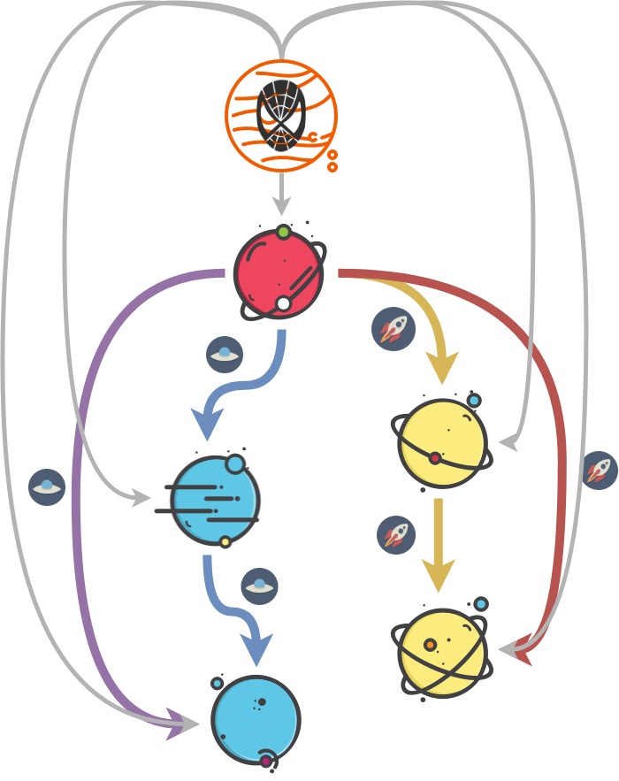
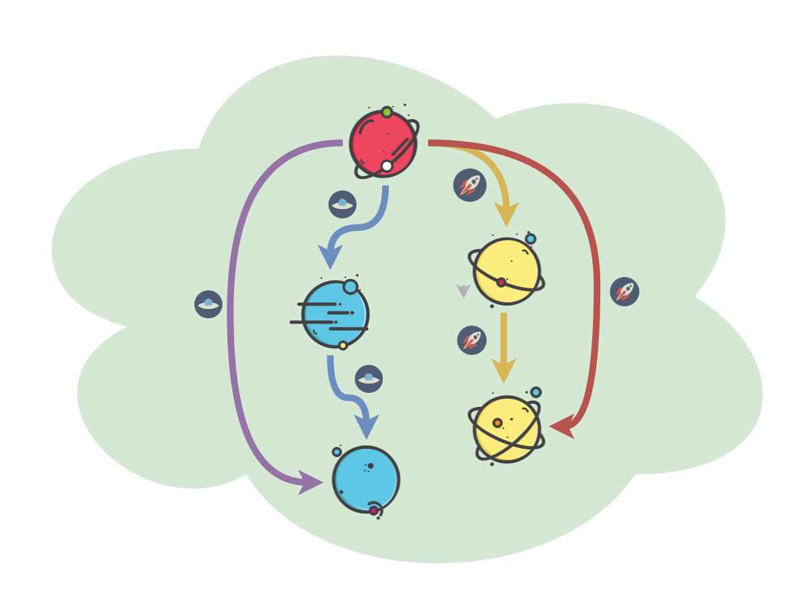
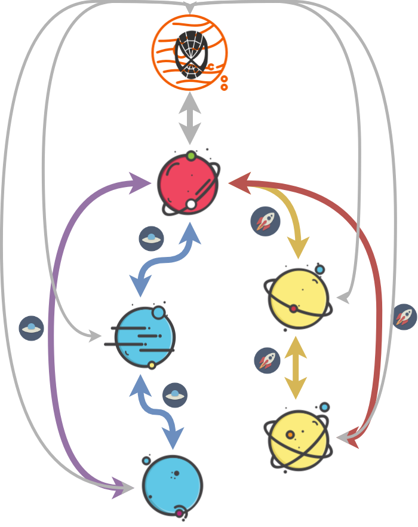
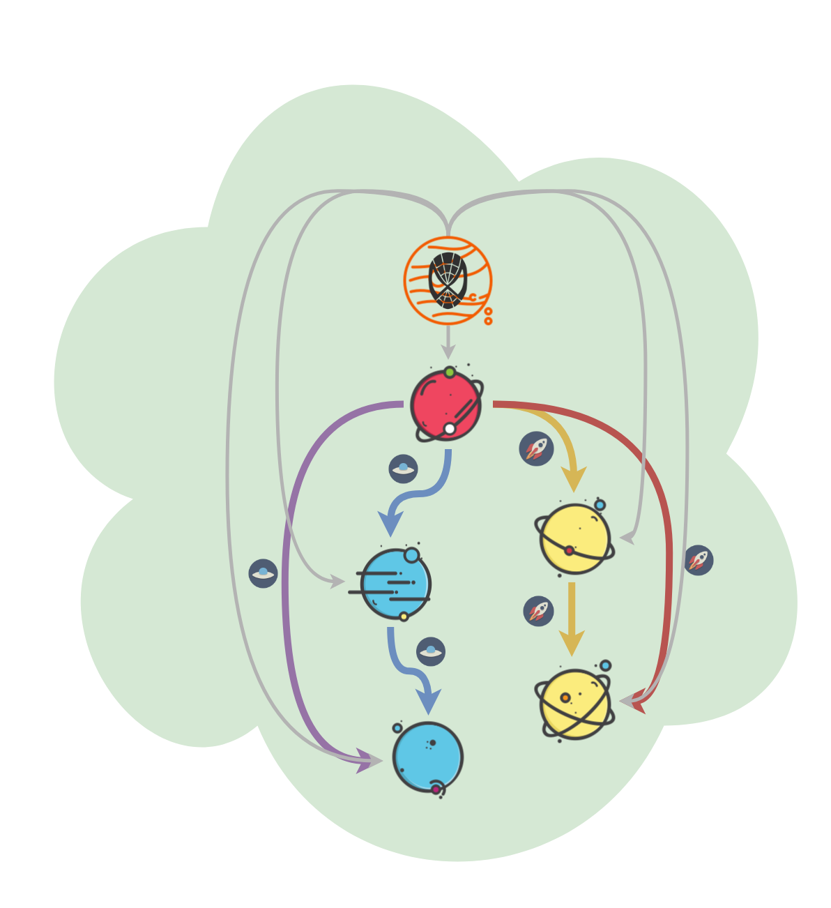
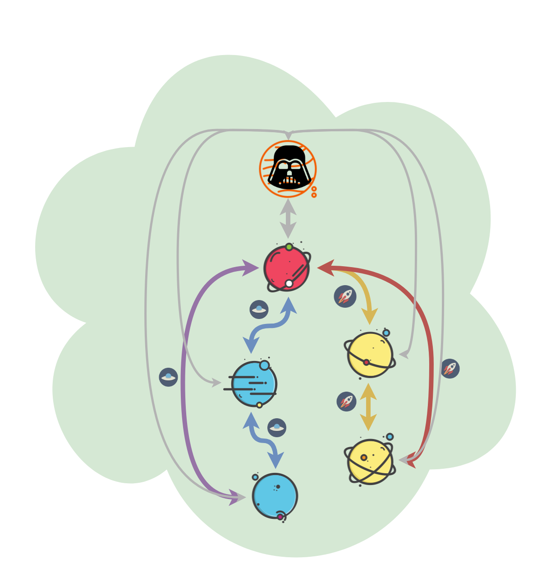

<!-- START doctoc generated TOC please keep comment here to allow auto update -->
<!-- DON'T EDIT THIS SECTION, INSTEAD RE-RUN doctoc TO UPDATE -->
****

- [Groups and family](#groups-and-family)
  - [Conditions](#conditions)
  - [Magma](#magma)
  - [Semigroupoid](#semigroupoid)
  - [Small category](#small-category)
  - [Semigroup](#semigroup)
  - [Groupoid](#groupoid)
  - [Monoid](#monoid)
  - [Commutative Monoid](#commutative-monoid)
  - [Group](#group)
  - [Abelian Group](#abelian-group)

<!-- END doctoc generated TOC please keep comment here to allow auto update -->


# Groups and family

```agda
open import Types.equality renaming (refl to ≡-refl)
open import Types.functions
open import Types.typeBasics

open import Level

module Algebra.groups {a ℓ} {A : Set a} (_==_ : Rel A ℓ) where

  open import Algebra.operations (_==_)
```

In mathematics, particularly in algebra, a "group" is an abstract structure with mappings between them that preserve that structure. These abstractions happen to be of immense usefulness from modeling certain phenomenon in physics to patterns in computer science. We have different classes or subtypes of groups, some with stronger conditions and some with weaker. Group-like structures can be thought of to be generated by varying which ones from a bunch of laws we choose to apply i.e. totality, `associativity`, `identity`, `iverse` and `commutativity`.

| Object ↓ Laws → |  Totality |  Associativity |  Identity |  Invertibility |  Commutativity |
| --- | --- | --- | --- | --- | --- |
| Magma |  ★ |   |   |   |   |
| Semigroupoid |   |  ★ |   |   |   |
| Small Category |   |  ★ |  ★ |   |
| Quasigroup |  ★ |   |   |  ★ |   |
| Loop |  ★ |   |  ★ |  ★ |   |
| Semigroup |  ★ |  ★ |   |   |   |
| Inverse Semigroup |  ★ |  ★ |   |  ★ |   |
| Groupoid |   |  ★ |  ★ |  ★ |   |
| Monoid |  ★ |  ★ |  ★ |   |   |
| Group |  ★ |  ★ |  ★ |  ★ |   |
| Abelian group |  ★ |  ★ |  ★ |  ★ |  ★ |


## Conditions

Here we encode the conditions for any given binary operation `_∙_` or operation-object pair to satisfy being an algebraic object. We define the actual objects in the next section.

## Magma


```agda
  record IsMagma (∙ : ★ A) : Set (a ⊔ ℓ) where
    field
      isEquivalence : IsEquivalence _==_
      ∙-cong        : Congruent₂ ∙

    open IsEquivalence isEquivalence public

    ∙-congˡ : LeftCongruent ∙
    ∙-congˡ y==z = ∙-cong y==z rfl

    ∙-congʳ : RightCongruent ∙
    ∙-congʳ y==z = ∙-cong rfl y==z
```

## Semigroupoid


```agda
  record IsSemigroupoid (∙ : ★ A) : Set (a ⊔ ℓ) where
    field
      isEquivalence : IsEquivalence _==_
      assoc         : Associative ∙

    open IsEquivalence isEquivalence public
```

## Small category



```agda
  record IsSmallCategory (∙ : ★ A) (x : A) : Set (a ⊔ ℓ) where
    field
      isSemigroupoid    : IsSemigroupoid ∙
      identity          : Identity x ∙

    open IsSemigroupoid isSemigroupoid public

    identityˡ : LeftIdentity x ∙
    identityˡ = fst identity

    identityʳ : RightIdentity x ∙
    identityʳ = snd identity
```

## Semigroup



```agda
  record IsSemigroup (∙ : ★ A) : Set (a ⊔ ℓ) where
    field
      isMagma : IsMagma ∙
      assoc   : Associative ∙

    open IsMagma isMagma public
```

## Groupoid



```agda
  record IsGroupoid (∙ : ★ A) (x : A) (x⁻¹ : ♠ A) : Set (a ⊔ ℓ) where
    field
      isSmallCategory   : IsSmallCategory ∙ x
      inverse           : Inverse x x⁻¹ ∙

    open IsSmallCategory isSmallCategory public

    inverseˡ : LeftInverse x x⁻¹ ∙
    inverseˡ = fst inverse

    inverseʳ : RightInverse x x⁻¹ ∙
    inverseʳ = snd inverse
```

## Monoid



```agda
  record IsMonoid (∙ : ★ A) (x : A) : Set (a ⊔ ℓ) where
    field
      isSemigroup : IsSemigroup ∙
      identity    : Identity x ∙

    open IsSemigroup isSemigroup public

    identityˡ : LeftIdentity x ∙
    identityˡ = fst identity

    identityʳ : RightIdentity x ∙
    identityʳ = snd identity
```

## Commutative Monoid



```agda
  record IsCommutativeMonoid (∙ : ★ A) (x : A) : Set (a ⊔ ℓ) where
    field
      isSemigroup : IsSemigroup ∙
      identityˡ   : LeftIdentity x ∙
      identityʳ   : RightIdentity x ∙
      comm        : Commutative ∙

    open IsSemigroup isSemigroup public

    identity : Identity x ∙
    identity = (identityˡ , identityʳ)

    isMonoid : IsMonoid ∙ x
    isMonoid = record
      { isSemigroup = isSemigroup
      ; identity    = identity
      }
```

## Group


```agda
  record IsGroup (_∙_ : ★ A) (x : A) (_⁻¹ : ♠ A) : Set (a ⊔ ℓ) where
    field
      isMonoid  : IsMonoid _∙_ x
      inverse   : Inverse x _⁻¹ _∙_
      ⁻¹-cong   : Congruent₁ _⁻¹

    open IsMonoid isMonoid public

    infixl 7 _-_
    _-_ : ★ A
    x - y = x ∙ (y ⁻¹)

    inverseˡ : LeftInverse x _⁻¹ _∙_
    inverseˡ = fst inverse

    inverseʳ : RightInverse x _⁻¹ _∙_
    inverseʳ = snd inverse
```

## Abelian Group

```agda
  record IsAbelianGroup (∙ : ★ A) (x : A) (⁻¹ : ♠ A) : Set (a ⊔ ℓ) where
    field
      isGroup : IsGroup ∙ x ⁻¹
      comm    : Commutative ∙

    open IsGroup isGroup public
```


****
[Back to Contents](./contents.html)
