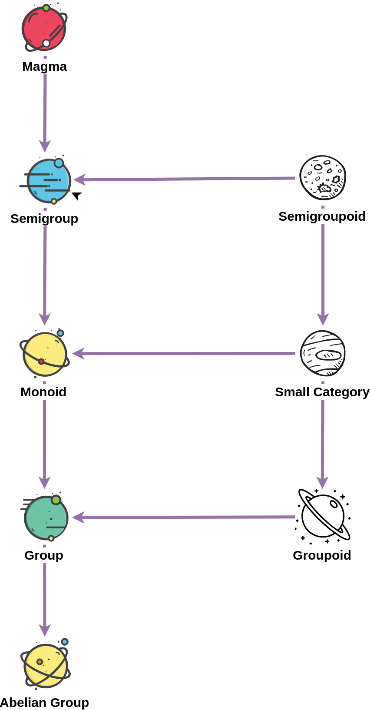

****
[Contents](contents.html)
[Previous](Algebra.order.html)
[Next](Algebra.groups2.html)

<!-- START doctoc generated TOC please keep comment here to allow auto update -->
<!-- DON'T EDIT THIS SECTION, INSTEAD RE-RUN doctoc TO UPDATE -->
****

- [Groups and family](#groups-and-family)
  - [Magma](#magma)
  - [Semigroup](#semigroup)
  - [Monoid](#monoid)
  - [Commutative Monoid](#commutative-monoid)
  - [Group](#group)
  - [Abelian Group](#abelian-group)

<!-- END doctoc generated TOC please keep comment here to allow auto update -->


# Groups and family

```agda
open import Types.equality renaming (refl to ≡-refl)
open import Types.functions
open import Types.product

open import Agda.Primitive using (Level; _⊔_; lsuc; lzero)

module Algebra.groups {a ℓ} {A : Set a} (_==_ : Rel A ℓ) where

  open import Types.operations (_==_)
```

Group-like objects form another family of objects probed in abstract algebra. They have a similar pattern of building like ordered objects but are more complex. This family contains of a set of type `A` and a binary operation `⋅` defined on that set which satisfy a bunch of properties.  As there are a large number of properties to choose from, one can end up with a large number of families, however here we describe only a few that generally matter.

| Object ↓ Laws → |  Totality |  Associativity |  Identity |  Invertibility |  Commutativity |
| --- | --- | --- | --- | --- | --- |
| Magma |  ★ |   |   |   |   |
| Semigroupoid |   |  ★ |   |   |   |
| Small Category |   |  ★ |  ★ |   |   |
| Quasigroup |  ★ |   |   |  ★ |   |
| Loop |  ★ |   |  ★ |  ★ |   |
| Semigroup |  ★ |  ★ |   |   |   |
| Inverse Semigroup |  ★ |  ★ |   |  ★ |   |
| Groupoid |   |  ★ |  ★ |  ★ |   |
| Monoid |  ★ |  ★ |  ★ |   |   |
| Group |  ★ |  ★ |  ★ |  ★ |   |
| Abelian group |  ★ |  ★ |  ★ |  ★ |  ★ |

Note that we implement only the packaged version of laws here, the actual object types we define in the next section [Groups and family 2](./Algebra.groups2.html), this is precisely because we cannot have two high level modules per agda file.



As we see above, semigroupoid is a generalization of the semigroup, group is a stricter form of a monoid or all groups are also monoids etc. Semigroupoids, Small Categories and Groupoids form what is called as partial abstract algebra such that they don't require the totality property which thus allows their operations to be partial functions.

## Magma

A magma is a set of objects with a closed binary operation defined on them. It is one of the simplest objects in abstract algebra.

A magma is a structure containing:

- A set $𝔽$
- A binary operation: `∙`

where:

1. `∙` is closed, i.e. `∀ x y ∈ 𝔽, (x ∙ y) ∈ 𝔽` or `∙ : 𝔽 × 𝔽 → 𝔽`


```agda
  record IsMagmaMinimal (∙ : ★ A) : Set (a ⊔ ℓ) where
```

However, we define a more constrained magma, where:

1. The set `𝔽` has an underlying equivalence relation `==` (can simply use setoids instead)
2. `∙` is congruent over the underlying equality `==`
3. `∙` is closed, i.e. `∀ x y ∈ 𝔽, (x ∙ y) ∈ 𝔽` or `∙ : 𝔽 × 𝔽 → 𝔽`

```agda
  record IsMagma (∙ : ★ A) : Set (a ⊔ ℓ) where
    field
      ∙-cong        : Congruent₂ ∙
      isEquivalence : IsEquivalence _==_

    open IsEquivalence isEquivalence public

    -- utils
    ∙-congˡ : LeftCongruent ∙
    ∙-congˡ y==z = ∙-cong y==z rfl

    ∙-congʳ : RightCongruent ∙
    ∙-congʳ y==z = ∙-cong rfl y==z
```

## Semigroup

A semigroup is a structure where the operation is associative.

A magma is a structure containing:

- A set $𝔽$
- A binary operation: `∙`

where:

1. `∙` is closed, i.e. `∀ x y ∈ 𝔽, (x ∙ y) ∈ 𝔽` or `∙ : 𝔽 × 𝔽 → 𝔽`
2. `∙` is associative, i.e. `x ∙ (y ∙ z) == (x ∙ y) ∙ z`

```agda
  record IsSemigroup (∙ : ★ A) : Set (a ⊔ ℓ) where
    field
      isMagma : IsMagma ∙
      assoc   : Associative ∙

    open IsMagma isMagma public
```

## Monoid

A monoid is a semigroup, with a special element called the identity element. Monoids and semigroups are perhaps of most significance to programmers as these are widely used to model various types and operations on them. For example, JSON objects and a `merge` operation on them form a monoid. Strings and string concatenation form monoids too.

Here are a few examples of monoids:

| Object | Operation | Identity |
| --- | --- | --- |
| int | addition | 0 |
| int | subtraction | 0 |
| int | multiplication | 1 |
| float | addition | 0.0 |
| float | subtraction | 0.0 |
| float | multiplication | 1.0 |
| JSON | merge two JSONs | `{}` |
| JSON | create / delete / modify a key-value pair | `{}` |
| JSON | `λ : JSON<A, B>, JSON<A, B> → JSON<A, B>` | `{}` |
| string | concatenation | `''` |
| List / Array | concatenation | `[]` |

Monoidal operations (`∙ : A × A → A`) take two elements and "reduce" or "combine" them into one. In other words they can be used to model types that can be aggregated, as one could take successive pairs of objects from a monoid and combine them with the monoidal operation `∙ : A × A → A`. This is reflected in the fact that only "certain types" may be "reduced" using "certain type" of functions. The "reduce" here refers to a standard map-reduce operation.

A monoid is a structure containing:

- A set $𝔽$
- A binary operation: `∙`

where:

1. `∙` is closed, i.e. `∀ x y ∈ 𝔽, (x ∙ y) ∈ 𝔽` or `∙ : 𝔽 × 𝔽 → 𝔽`
2. `∙` is associative, i.e. `x ∙ (y ∙ z) == (x ∙ y) ∙ z`
3. `∙` has an identity, i.e. `∃ i ∈ A, i ∙ i = i`

```agda
  record IsMonoid (∙ : ★ A) (x : A) : Set (a ⊔ ℓ) where
    field
      isSemigroup : IsSemigroup ∙
      identity    : Identity x ∙

    open IsSemigroup isSemigroup public

    -- utils
    identityˡ : LeftIdentity x ∙
    identityˡ = fst identity

    identityʳ : RightIdentity x ∙
    identityʳ = snd identity
```

## Commutative Monoid

A commutative monoid is a monoid with its operation required to be commutative.

A commutative monoid is a structure containing:

- A set $𝔽$
- A binary operation: `∙`

where:

1. `∙` is closed, i.e. `∀ x y ∈ 𝔽, (x ∙ y) ∈ 𝔽` or `∙ : 𝔽 × 𝔽 → 𝔽`
2. `∙` is associative, i.e. `x ∙ (y ∙ z) == (x ∙ y) ∙ z`
3. `∙` has an identity, i.e. `∃ i ∈ A, i ∙ i = i`
4. `∙` is commutative, i.e. `x ∙ y = y ∙ x`

```agda
  record IsCommutativeMonoid (∙ : ★ A) (x : A) : Set (a ⊔ ℓ) where
    field
      isMonoid : IsMonoid ∙ x
      comm        : Commutative ∙

    open IsMonoid isMonoid public
```

## Group

A group is a monoid with the additional requirement of the binary operation to have an inverse operation for every pair of elements of the group. A group is another widely-used structure.

| Field | Used to model |
| --- | --- |
| Physics | Symmetry in Noether's theorem |
| Physics | Gauge theories (quantum electrodynamics, quantum field theory) |
| Physics | Gauge formulation of general relativity |
| Physics | M-brane theory (and other string theories) |
| Chemistry | Classification of crystal structure |
| Chemistry | Symmetries of molecules |
| Cryptography | ECDSA (Elliptic Curve Digital Signature Algorithm) signatures |

A group is a structure containing:

- A set $𝔽$
- A binary operation: `∙`

where:

1. `∙` is closed, i.e. `∀ x y ∈ 𝔽, (x ∙ y) ∈ 𝔽` or `∙ : 𝔽 × 𝔽 → 𝔽`
2. `∙` is associative, i.e. `x ∙ (y ∙ z) == (x ∙ y) ∙ z`
3. `∙` has an identity, i.e. `∃ i ∈ A, i ∙ i = i`
4. every object `x` has an inverse `x⁻¹`, such that `((x ⁻¹) ∙ x) == i`

```agda
  record IsGroup (_∙_ : ★ A) (x : A) (_⁻¹ : ♠ A) : Set (a ⊔ ℓ) where
    field
      isMonoid  : IsMonoid _∙_ x
      inverse   : Inverse x _⁻¹ _∙_
      ⁻¹-cong   : Congruent₁ _⁻¹

    open IsMonoid isMonoid public

    infixl 7 _-_
    _-_ : ★ A
    x - y = x ∙ (y ⁻¹)

    inverseˡ : LeftInverse x _⁻¹ _∙_
    inverseˡ = fst inverse

    inverseʳ : RightInverse x _⁻¹ _∙_
    inverseʳ = snd inverse

    open import Types.equational2
    open withCongruence _==_ _∙_ _⁻¹ rfl trans sym ∙-cong x public

    -- uniqueness of the inverses
    uniqueˡ-⁻¹ : ∀ α β → (α ∙ β) == x → α == (β ⁻¹)
    uniqueˡ-⁻¹ = assoc+id+invʳ⇒invˡ-unique assoc identity inverseʳ

    uniqueʳ-⁻¹ : ∀ α β → (α ∙ β) == x → β == (α ⁻¹)
    uniqueʳ-⁻¹ = assoc+id+invˡ⇒invʳ-unique assoc identity inverseˡ
```

## Abelian Group

An Abelian group, named after Niels Henrik Abel, is a group and requires its operation to also be commutative.

An abelian group is a structure containing:

- A set $𝔽$
- A binary operation: `∙`

where:

1. `∙` is closed, i.e. `∀ x y ∈ 𝔽, (x ∙ y) ∈ 𝔽` or `∙ : 𝔽 × 𝔽 → 𝔽`
2. `∙` is associative, i.e. `x ∙ (y ∙ z) == (x ∙ y) ∙ z`
3. `∙` has an identity, i.e. `∃ i ∈ A, i ∙ i = i`
4. `∙` is commutative, i.e. `x ∙ y = y ∙ x`
5. every object `x` has an inverse `x⁻¹`, such that `((x ⁻¹) ∙ x) == i`

```agda
  record IsAbelianGroup (∙ : ★ A) (x : A) (⁻¹ : ♠ A) : Set (a ⊔ ℓ) where
    field
      isGroup : IsGroup ∙ x ⁻¹
      comm    : Commutative ∙

    open IsGroup isGroup public

    isCommutativeMonoid : IsCommutativeMonoid ∙ x
    isCommutativeMonoid = record
      { isMonoid = isMonoid
      ; comm = comm
      }
```

****
[Groups and family 2](./Algebra.groups2.html)
