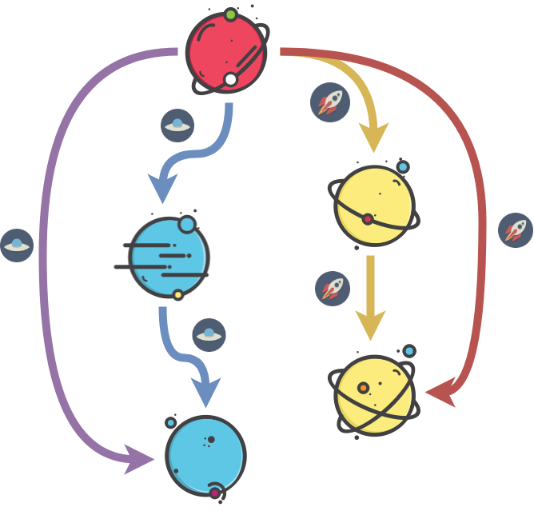

<!-- START doctoc generated TOC please keep comment here to allow auto update -->
<!-- DON'T EDIT THIS SECTION, INSTEAD RE-RUN doctoc TO UPDATE -->
****

- [Groups and family](#groups-and-family)
  - [Conditions](#conditions)
  - [Magma](#magma)
  - [Semigroupoid](#semigroupoid)
  - [Small category](#small-category)
  - [Semigroup](#semigroup)
  - [Groupoid](#groupoid)
  - [Monoid](#monoid)
  - [Commutative Monoid](#commutative-monoid)
  - [Group](#group)
  - [Abelian Group](#abelian-group)

<!-- END doctoc generated TOC please keep comment here to allow auto update -->


# Groups and family

```agda
open import Types.equality renaming (refl to ≡-refl)
open import Types.functions
open import Types.typeBasics

open import Agda.Primitive using (Level; _⊔_; lsuc; lzero)

module Algebra.groups {a ℓ} {A : Set a} (_==_ : Rel A ℓ) where

  open import Algebra.operations (_==_)
```

Algebraic structures, studied in the field of abstract algebra, can be thought of to be generated by varying which ones from a bunch of laws or axioms we choose to apply i.e. `totality`, `associativity`, `identity`, `iverse` and `commutativity`.

| Object ↓ Laws → |  Totality |  Associativity |  Identity |  Invertibility |  Commutativity |
| --- | --- | --- | --- | --- | --- |
| Magma |  ★ |   |   |   |   |
| Semigroupoid |   |  ★ |   |   |   |
| Small Category |   |  ★ |  ★ |   |   |
| Quasigroup |  ★ |   |   |  ★ |   |
| Loop |  ★ |   |  ★ |  ★ |   |
| Semigroup |  ★ |  ★ |   |   |   |
| Inverse Semigroup |  ★ |  ★ |   |  ★ |   |
| Groupoid |   |  ★ |  ★ |  ★ |   |
| Monoid |  ★ |  ★ |  ★ |   |   |
| Group |  ★ |  ★ |  ★ |  ★ |   |
| Abelian group |  ★ |  ★ |  ★ |  ★ |  ★ |

Some of these objects can be visualized as if they were successors of each other, with the ones at the bottom more "strict" as in with more restrictions in the form of supported laws. We also code them this way below.


As we see above, semigroupoid is a generalization of the semigroup, group is a stricter form of a monoid or all groups are also monoids etc. Semigroupoids, Small Categories and Groupoids form what is called as partial abstract algebra such that they dont require the totality axiom which thus allows their operations to be partial functions.

## Conditions

Here we encode the conditions for any given binary operation `_∙_` or operation-object pair to satisfy being an algebraic object. We define the actual objects in the next section.

## Magma

A magma is a set of objects with an equivalence relation defined on them. It is one of the simplest objects in abstract algebra.


```agda
  record IsMagma (∙ : ★ A) : Set (a ⊔ ℓ) where
    field
      isEquivalence : IsEquivalence _==_
      ∙-cong        : Congruent₂ ∙

    open IsEquivalence isEquivalence public

    ∙-congˡ : LeftCongruent ∙
    ∙-congˡ y==z = ∙-cong y==z rfl

    ∙-congʳ : RightCongruent ∙
    ∙-congʳ y==z = ∙-cong rfl y==z
```

## Semigroupoid

A semigroupoid is a set of objects some of which support an operation `★`, which must be associative.



```agda
  record IsSemigroupoid (∙ : ★ A) : Set (a ⊔ ℓ) where
    field
      isEquivalence : IsEquivalence _==_
      ∙-cong        : Congruent₂ ∙
      assoc         : Associative ∙

    open IsEquivalence isEquivalence public

    ∙-congˡ : LeftCongruent ∙
    ∙-congˡ y==z = ∙-cong y==z rfl

    ∙-congʳ : RightCongruent ∙
    ∙-congʳ y==z = ∙-cong rfl y==z
```

## Small category

A small category suports identities and the operation supports the identity function. Apart from that, it inherits all properties of a semigroupoid.


```agda
  record IsSmallCategory (∙ : ★ A) (x : A) : Set (a ⊔ ℓ) where
    field
      isSemigroupoid    : IsSemigroupoid ∙
      identity          : Identity x ∙

    open IsSemigroupoid isSemigroupoid public

    identityˡ : LeftIdentity x ∙
    identityˡ = fst identity

    identityʳ : RightIdentity x ∙
    identityʳ = snd identity
```

## Semigroup

A semigroup is a structure where the operation is associative. It differs with semigroupoids as in the operation for semigroups are total (or cannot be partial). Hence, semigroupoids are a generalization of semigroups. Semigroups are essentially semigroupoids with the totality condition.


```agda
  record IsSemigroup (∙ : ★ A) : Set (a ⊔ ℓ) where
    field
      isMagma : IsMagma ∙
      assoc   : Associative ∙

    open IsMagma isMagma public
```

## Groupoid

A groupoid is a small category with the restriction that the operation has have its inverse defined.


```agda
  record IsGroupoid (_∙_ : ★ A) (x : A) (_⁻¹ : ♠ A) : Set (a ⊔ ℓ) where
    field
      isSmallCategory   : IsSmallCategory _∙_ x
      inverse           : Inverse x _⁻¹ _∙_

    open IsSmallCategory isSmallCategory public

    inverseˡ : LeftInverse x _⁻¹ _∙_
    inverseˡ = fst inverse

    inverseʳ : RightInverse x _⁻¹ _∙_
    inverseʳ = snd inverse

    open import Algebra.equational
    open withCongruence _==_ _∙_ _⁻¹ rfl trans sym ∙-cong x public

    -- uniqueness of the inverses
    uniqueˡ-⁻¹ : ∀ α β → (α ∙ β) == x → α == (β ⁻¹)
    uniqueˡ-⁻¹ = assoc+id+invʳ⇒invˡ-unique assoc identity inverseʳ

    uniqueʳ-⁻¹ : ∀ α β → (α ∙ β) == x → β == (α ⁻¹)
    uniqueʳ-⁻¹ = assoc+id+invˡ⇒invʳ-unique assoc identity inverseˡ
```

## Monoid

A monoid is a structure formed by adding the totality condition to small categories.


```agda
  record IsMonoid (∙ : ★ A) (x : A) : Set (a ⊔ ℓ) where
    field
      isSemigroup : IsSemigroup ∙
      identity    : Identity x ∙

    open IsSemigroup isSemigroup public

    identityˡ : LeftIdentity x ∙
    identityˡ = fst identity

    identityʳ : RightIdentity x ∙
    identityʳ = snd identity
```

## Commutative Monoid

A commutative monoid is a monoid with its operation required to be commutative.


```agda
  record IsCommutativeMonoid (∙ : ★ A) (x : A) : Set (a ⊔ ℓ) where
    field
      isSemigroup : IsSemigroup ∙
      identityˡ   : LeftIdentity x ∙
      identityʳ   : RightIdentity x ∙
      comm        : Commutative ∙

    open IsSemigroup isSemigroup public

    identity : Identity x ∙
    identity = (identityˡ , identityʳ)

    isMonoid : IsMonoid ∙ x
    isMonoid = record
      { isSemigroup = isSemigroup
      ; identity    = identity
      }
```

## Group

A group is a monoid with requiring for inverses to exist for every pair of elements. A groupoid is a generalization of groups by removing the totality restriction.


```agda
  record IsGroup (_∙_ : ★ A) (x : A) (_⁻¹ : ♠ A) : Set (a ⊔ ℓ) where
    field
      isMonoid  : IsMonoid _∙_ x
      inverse   : Inverse x _⁻¹ _∙_
      ⁻¹-cong   : Congruent₁ _⁻¹

    open IsMonoid isMonoid public

    infixl 7 _-_
    _-_ : ★ A
    x - y = x ∙ (y ⁻¹)

    inverseˡ : LeftInverse x _⁻¹ _∙_
    inverseˡ = fst inverse

    inverseʳ : RightInverse x _⁻¹ _∙_
    inverseʳ = snd inverse

    open import Algebra.equational
    open withCongruence _==_ _∙_ _⁻¹ rfl trans sym ∙-cong x public

    -- uniqueness of the inverses
    uniqueˡ-⁻¹ : ∀ α β → (α ∙ β) == x → α == (β ⁻¹)
    uniqueˡ-⁻¹ = assoc+id+invʳ⇒invˡ-unique assoc identity inverseʳ

    uniqueʳ-⁻¹ : ∀ α β → (α ∙ β) == x → β == (α ⁻¹)
    uniqueʳ-⁻¹ = assoc+id+invˡ⇒invʳ-unique assoc identity inverseˡ
```

## Abelian Group

An Abelian group, named after Niels Henrik Abel, isb a group and requires its operation to also be commutative.

```agda
  record IsAbelianGroup (∙ : ★ A) (x : A) (⁻¹ : ♠ A) : Set (a ⊔ ℓ) where
    field
      isGroup : IsGroup ∙ x ⁻¹
      comm    : Commutative ∙

    open IsGroup isGroup public
```


****
[Groups and family 2](./Algebra.structures.html)
