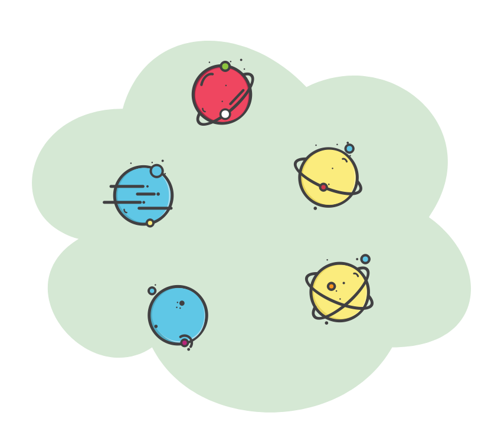

****
[Contents](contents.html)

<!-- START doctoc generated TOC please keep comment here to allow auto update -->
<!-- DON'T EDIT THIS SECTION, INSTEAD RE-RUN doctoc TO UPDATE -->
****

- [Algebraic structures](#algebraic-structures)

<!-- END doctoc generated TOC please keep comment here to allow auto update -->


# Algebraic structures

```agda
module Algebra.introduction where
```

Algebra is essentially any system dealing with

- Abstract symbols as objects
- APIs - rules, laws, or in general, operations for manipulating such symbols

Each algebra behaves more like a [DSL](https://en.wikipedia.org/wiki/Domain-specific_language), consisting of a structure and a bunch of operations packaged together. Now, elementary set theory tends to treat objects and operations separately. However, objects when considered together with some operations give rise to complex structures and allow a bunch of laws and other machinery to be built on top of them. Consider natural numbers and the operation of additon for example, for any two natural numbers `x` and `y` and the addition operation `+`, $x + y$ is always a natural number, $x + y = y + x$, $(x + y) + z = x + (y + z)$ and so on. Thus we can refer to all natural numbers and addition together as something called a "group". It turns out such structures have rich APIs and can be used to model and represent wide range of real world phenomenon. Groups can be easily encountered in undergraduate and above level physics which makes extensive use of the concepts of symmetry. We vary some basic properties of these operations and call the resulting objects with various esoteric names like "Monoid", "Semigroupoid" etc. Though one could argue that knowing concepts behind such esoteric names entitles one to use them to intrigue an unsuspecting audience.

The most basic operation that can be done to an object or to a collection (set) of objects is to compare them, e.g, using equivalences (≡). Thus equivalanences can be used as a law for creating albegras of `Setoid`s - sets with equivalences. The operation of sorting using some definition of an order (≥, ≤) is another such basic law used to construct higher objects and their algebras such as `Poset`s and `PreOrder`s. In this way we construct higher algerbaic objects on top of simpler ones.



Generally, more complex structures can be created using operations that support the laws of associativity, commutativitiy and inverse. An example of this would be natural numbers, which support operations such as addition, subtraction, multiplication and division (except with 0), all of which are associative and commutative, forming the peano arithmetic. Another example is what we have already seen in the case of boolean algebra where `∧` and `∨` follow the [laws of boolean algebra](./Logic.laws.html). There are more complex objects that follow essentially the same principles of construction.

General classification of abstract algebras include

| Number of Binary operations | Sets | Examples |
| --- | --- | --- |
| 1 | 1 | Magma, Semigroupoid, Small Category, Semigroup, Groupoid, Monoid, Group |
| 2 | 1 | Ring, Lattics, Semiring |
| 2 | 2 | Vector Spaces, Modules |
| 3 | 2 | Algebra over a field, Algebra over a ring |

We can always mix and match and create objects of higher complexity. There are also a varying mix of objects and their algebras tying other areas of mathematics like differential geometry, topology, number theory.

So far we have had a glimpse of boolean algebra. Here we start to dive into more complex structures. Most of these structures are constructed by picking and choosing certain underlying laws or properties of these objects' APIs. We first start with building such laws. Many of these laws are similar to the ones of logic that we derived in a [previous part](./Logic.laws.html/#operations). We then diverge a bit and look at what equational reasoning is, how it is useful in proving theorems and and how we can do that in Agda. We then get right back into defining group-like objects and their properties.

****
[Operations](./Algebra.operations.html)
