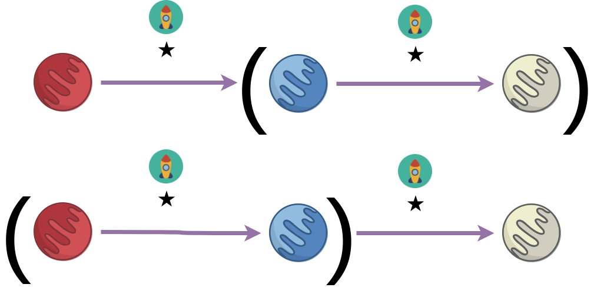
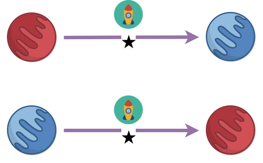
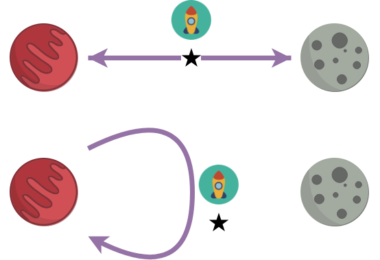
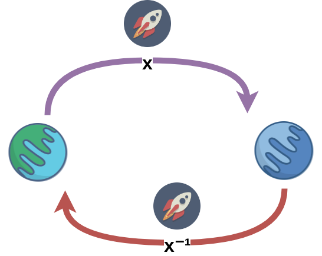
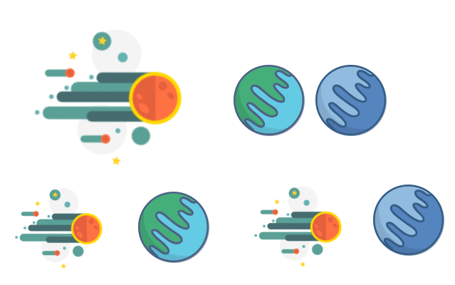

****
[Contents](contents.html)

<!-- START doctoc generated TOC please keep comment here to allow auto update -->
<!-- DON'T EDIT THIS SECTION, INSTEAD RE-RUN doctoc TO UPDATE -->
****

- [Operations](#operations)
  - [Operator laws](#operator-laws)
    - [Associativity](#associativity)
    - [Commutativity](#commutativity)
    - [Identity](#identity)
    - [Elimination](#elimination)
    - [Inverse](#inverse)
    - [Distributive](#distributive)
    - [Absorptive](#absorptive)
    - [Cancellative](#cancellative)
    - [Congruence](#congruence)
  - [Respecting a law](#respecting-a-law)

<!-- END doctoc generated TOC please keep comment here to allow auto update -->


# Operations

We start by defining operations and laws they obey.

```agda
open import Types.equality
open import Types.functions
open import Types.typeBasics

open import Agda.Primitive using (Level; _⊔_; lsuc; lzero)

module Algebra.operations {a ℓ} {A : Set a} (_==_ : Rel A ℓ) where
```

A homogenous binary operation `★ A` can be defined as:

```agda
  ★_ : ∀ {a} → Set a → Set a
  ★ A = A → A → A
```

and a unary operation as:

```agda
  ♠_ : ∀ {a} → Set a → Set a
  ♠ A = A → A
```

## Operator laws

We now write a few laws that operators could follow. Essentially, structures built on top of these operators would end up following the same laws as the underlying operator. We have already seen some of these laws in [laws of boolean algebra](./Logic.laws.html), these are universe polymorphism-accounted general versions of those laws.

### Associativity



Mathematically, given an operation `★`, it is called associative if:

```math
∀ x, y, z ∈ A,
operation ★ is associative if:

x ★ (y ★ z) ≡ (x ★ y) ★ z
```

```agda
  Associative : ★ A → Set _
  Associative _∙_ = ∀ x y z → ((x ∙ y) ∙ z) == (x ∙ (y ∙ z))
```

### Commutativity



Commutativity is defined as:

```math
∀ x, y ∈ A,
operation ★ is commutative if:

x ★ y ≡ y ★ x
```

```agda
  Commutative : ★ A → Set _
  Commutative _∙_ = ∀ x y → (x ∙ y) == (y ∙ x)
```

### Identity


```math
∀ x ∈ A,
if id is the identity object of A,

x ★ id ≡ x
id ★ x ≡ x
```

We treat identity as a pair of right and left identities. This helps in working with non-commutative types as well.

```agda
  LeftIdentity : A → ★ A → Set _
  LeftIdentity e _∙_ = ∀ x → (e ∙ x) == x

  RightIdentity : A → ★ A → Set _
  RightIdentity e _∙_ = ∀ x → (x ∙ e) == x

  Identity : A → ★ A → Set _
  Identity e ∙ = LeftIdentity e ∙ × RightIdentity e ∙
```

### Elimination



```math
∀ x ∈ A,

x ★ 0 ≡ 0
0 ★ x ≡ 0
```

How does our object interact with `0`? We define that here.

```agda
  LeftZero : A → ★ A → Set _
  LeftZero z _∙_ = ∀ x → (z ∙ x) == z

  RightZero : A → ★ A → Set _
  RightZero z _∙_ = ∀ x → (x ∙ z) == z

  Zero : A → ★ A → Set _
  Zero z ∙ = LeftZero z ∙ × RightZero z ∙
```

### Inverse



```math
∀ x ∈ A, ∃ x⁻¹ ∈ A such that

x ★ x⁻¹ ≡ id

x⁻¹ ★ x ≡ id
```

Given any unary function `_⁻¹`, we define what it takes for the function to qualify as an inverse.

```agda
  LeftInverse : A → ♠ A → ★ A → Set _
  LeftInverse e _⁻¹ _∙_ = ∀ x → ((x ⁻¹) ∙ x) == e

  RightInverse : A → ♠ A → ★ A → Set _
  RightInverse e _⁻¹ _∙_ = ∀ x → (x ∙ (x ⁻¹)) == e

  Inverse : A → ♠ A → ★ A → Set _
  Inverse e ⁻¹ ∙ = LeftInverse e ⁻¹ ∙ × RightInverse e ⁻¹ ∙
```

### Distributive



```math
∀ x, y, z ∈ A,
operation ★ is distributive if:

( x ★ y ) ★ z ≡ x ★ y × y ★ z
```

```agda
  _DistributesOverˡ_ : ★ A → ★ A → Set _
  _*_ DistributesOverˡ _+_ =
    ∀ x y z → (x * (y + z)) == ((x * y) + (x * z))

  _DistributesOverʳ_ : ★ A → ★ A → Set _
  _*_ DistributesOverʳ _+_ =
    ∀ x y z → ((y + z) * x) == ((y * x) + (z * x))

  _DistributesOver_ : ★ A → ★ A → Set _
  * DistributesOver + = (* DistributesOverˡ +) × (* DistributesOverʳ +)
```

### Absorptive


```math
∀ x ∈ A and two operations
 ∙ : A → A → A
 ∘ : A → A → A

operation ∙ absorbs ∘ if:

x ∙ (x ∘ y) ≡ x

and ∘ absorbs ∙ if:
x ∘ (x ∙ y) ≡ x

and if both are satisfied collectively ∙ and ∘ are absorptive.
```

```agda
  _Absorbs_ : ★ A → ★ A → Set _
  _∙_ Absorbs _∘_ = ∀ x y → (x ∙ (x ∘ y)) == x

  Absorptive : ★ A → ★ A → Set _
  Absorptive ∙ ∘ = (∙ Absorbs ∘) × (∘ Absorbs ∙)
```

### Cancellative


```math
∀ x, y ∈ A
and a function • : A → A → A,

(x • y) == (x • z) ⟹ y == z
```

```agda
  LeftCancellative : ★ A → Set _
  LeftCancellative _•_ = ∀ x {y z} → (x • y) == (x • z) → y == z

  RightCancellative : ★ A → Set _
  RightCancellative _•_ = ∀ {x} y z → (y • x) == (z • x) → y == z

  Cancellative : ★ A → Set _
  Cancellative _•_ = LeftCancellative _•_ × RightCancellative _•_
```

### Congruence


```math
Given
  a₁, a₂ ∈ A
  b₁ b₂ ∈ B
  ∙ : A → B,

if a₁ ≡ a₂,
   b₁ = ∙ a₁
   b₂ = ∙ a₂
then b₁ ≡ b₂
```

A congruent relation preserves equivalences.

```agda
  Congruent₁ : ♠ A → Set _
  Congruent₁ f = f Preserves _==_ ⟶ _==_

  Congruent₂ : ★ A → Set _
  Congruent₂ ∙ = ∙ Preserves₂ _==_ ⟶ _==_ ⟶ _==_

  LeftCongruent : ★ A → Set _
  LeftCongruent _∙_ = ∀ {x} → (_∙ x) Preserves _==_ ⟶ _==_

  RightCongruent : ★ A → Set _
  RightCongruent _∙_ = ∀ {x} → (x ∙_) Preserves _==_ ⟶ _==_
```

## Respecting a law

We finally define what we mean by "respects" a law. We define two versions here

- `_Respects_` for already commutative laws
- `_Respects₂_` which combines left and right laws

```agda
  _Respects_ : ∀ {a ℓ₁ ℓ₂} {A : Set a}
          → (A → Set ℓ₁)
          → Rel A ℓ₂
          → Set _
  P Respects _∼_ = ∀ {x y} → x ∼ y → P x → P y

  _Respectsʳ_ : ∀ {a ℓ₁ ℓ₂} {A : Set a}
          → Rel A ℓ₁
          → Rel A ℓ₂
          → Set _
  P Respectsʳ _∼_ = ∀ {x} → (P x) Respects _∼_

  _Respectsˡ_ : ∀ {a ℓ₁ ℓ₂} {A : Set a}
          → Rel A ℓ₁
          → Rel A ℓ₂
          → Set _
  P Respectsˡ _∼_ = ∀ {y} → (flip P y) Respects _∼_

  _Respects₂_ : ∀ {a ℓ₁ ℓ₂} {A : Set a}
          → Rel A ℓ₁
          → Rel A ℓ₂
          → Set _
  P Respects₂ _∼_ = (P Respectsʳ _∼_) × (P Respectsˡ _∼_)
```


****
[Equational Reasoning](./Algebra.equational.html)
