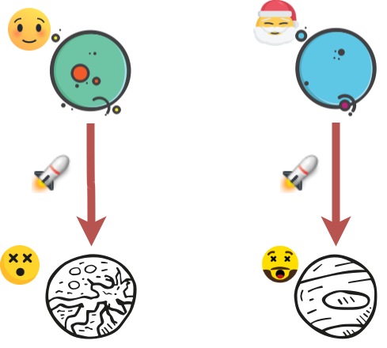

<!-- START doctoc generated TOC please keep comment here to allow auto update -->
<!-- DON'T EDIT THIS SECTION, INSTEAD RE-RUN doctoc TO UPDATE -->
****

- [Operations](#operations)
  - [Operator laws](#operator-laws)
    - [Associativity](#associativity)
    - [Commutativity](#commutativity)
    - [Identity](#identity)
    - [Elimination](#elimination)
    - [Inverse](#inverse)
    - [Distributive](#distributive)
    - [Absorptive](#absorptive)
    - [Cancellative](#cancellative)
    - [Congruence](#congruence)
  - [Respecting a law](#respecting-a-law)

<!-- END doctoc generated TOC please keep comment here to allow auto update -->


# Operations

We start by defining operations and laws they obey.

```agda
open import Types.equality
open import Types.functions
open import Types.typeBasics

open import Level

module Algebra.operations {a ℓ} {A : Set a} (_==_ : Rel A ℓ) where
```

A binary operation `★ A` can be defined as:

```agda
  ★_ : ∀ {a} → Set a → Set a
  ★ A = A → A → A
```

and a unary operation as:

```agda
  ♠_ : ∀ {a} → Set a → Set a
  ♠ A = A → A
```

## Operator laws

### Associativity


```agda
  Associative : ★ A → Set _
  Associative _∙_ = ∀ x y z → ((x ∙ y) ∙ z) == (x ∙ (y ∙ z))
```

### Commutativity


```agda
  Commutative : ★ A → Set _
  Commutative _∙_ = ∀ x y → (x ∙ y) == (y ∙ x)
```

### Identity


We treat identity as a pair of right and left identities.

```agda
  LeftIdentity : A → ★ A → Set _
  LeftIdentity e _∙_ = ∀ x → (e ∙ x) == x

  RightIdentity : A → ★ A → Set _
  RightIdentity e _∙_ = ∀ x → (x ∙ e) == x

  Identity : A → ★ A → Set _
  Identity e ∙ = LeftIdentity e ∙ × RightIdentity e ∙
```

### Elimination


```agda
  LeftZero : A → ★ A → Set _
  LeftZero z _∙_ = ∀ x → (z ∙ x) == z

  RightZero : A → ★ A → Set _
  RightZero z _∙_ = ∀ x → (x ∙ z) == z

  Zero : A → ★ A → Set _
  Zero z ∙ = LeftZero z ∙ × RightZero z ∙
```

### Inverse


```agda
  LeftInverse : A → ♠ A → ★ A → Set _
  LeftInverse e _⁻¹ _∙_ = ∀ x → ((x ⁻¹) ∙ x) == e

  RightInverse : A → ♠ A → ★ A → Set _
  RightInverse e _⁻¹ _∙_ = ∀ x → (x ∙ (x ⁻¹)) == e

  Inverse : A → ♠ A → ★ A → Set _
  Inverse e ⁻¹ ∙ = LeftInverse e ⁻¹ ∙ × RightInverse e ⁻¹ ∙
```

### Distributive


```agda
  _DistributesOverˡ_ : ★ A → ★ A → Set _
  _*_ DistributesOverˡ _+_ =
    ∀ x y z → (x * (y + z)) == ((x * y) + (x * z))

  _DistributesOverʳ_ : ★ A → ★ A → Set _
  _*_ DistributesOverʳ _+_ =
    ∀ x y z → ((y + z) * x) == ((y * x) + (z * x))

  _DistributesOver_ : ★ A → ★ A → Set _
  * DistributesOver + = (* DistributesOverˡ +) × (* DistributesOverʳ +)
```

### Absorptive


```agda
  _Absorbs_ : ★ A → ★ A → Set _
  _∙_ Absorbs _∘_ = ∀ x y → (x ∙ (x ∘ y)) == x

  Absorptive : ★ A → ★ A → Set _
  Absorptive ∙ ∘ = (∙ Absorbs ∘) × (∘ Absorbs ∙)
```

### Cancellative


```agda
  LeftCancellative : ★ A → Set _
  LeftCancellative _•_ = ∀ x {y z} → (x • y) == (x • z) → y == z

  RightCancellative : ★ A → Set _
  RightCancellative _•_ = ∀ {x} y z → (y • x) == (z • x) → y == z

  Cancellative : ★ A → Set _
  Cancellative _•_ = LeftCancellative _•_ × RightCancellative _•_
```

### Congruence



```agda
  Congruent₁ : ♠ A → Set _
  Congruent₁ f = f Preserves _==_ ⟶ _==_

  Congruent₂ : ★ A → Set _
  Congruent₂ ∙ = ∙ Preserves₂ _==_ ⟶ _==_ ⟶ _==_

  LeftCongruent : ★ A → Set _
  LeftCongruent _∙_ = ∀ {x} → (_∙ x) Preserves _==_ ⟶ _==_

  RightCongruent : ★ A → Set _
  RightCongruent _∙_ = ∀ {x} → (x ∙_) Preserves _==_ ⟶ _==_
```

## Respecting a law

```agda
  _Respects_ : ∀ {a ℓ₁ ℓ₂} {A : Set a}
          → (A → Set ℓ₁)
          → Rel A ℓ₂
          → Set _
  P Respects _∼_ = ∀ {x y} → x ∼ y → P x → P y

  _Respectsʳ_ : ∀ {a ℓ₁ ℓ₂} {A : Set a}
          → Rel A ℓ₁
          → Rel A ℓ₂
          → Set _
  P Respectsʳ _∼_ = ∀ {x} → (P x) Respects _∼_

  _Respectsˡ_ : ∀ {a ℓ₁ ℓ₂} {A : Set a}
          → Rel A ℓ₁
          → Rel A ℓ₂
          → Set _
  P Respectsˡ _∼_ = ∀ {y} → (flip P y) Respects _∼_

  _Respects₂_ : ∀ {a ℓ₁ ℓ₂} {A : Set a}
          → Rel A ℓ₁
          → Rel A ℓ₂
          → Set _
  P Respects₂ _∼_ = (P Respectsʳ _∼_) × (P Respectsˡ _∼_)
```


****
[Back to Contents](./contents.html)
