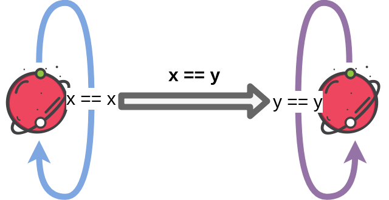

<!-- START doctoc generated TOC please keep comment here to allow auto update -->
<!-- DON'T EDIT THIS SECTION, INSTEAD RE-RUN doctoc TO UPDATE -->
****

- [The Identity Type](#the-identity-type)
  - [Path Induction](#path-induction)
  - [Path equivalence](#path-equivalence)

<!-- END doctoc generated TOC please keep comment here to allow auto update -->


# The Identity Type

```agda
module HoTT.identity where

open import Level using (Level; _⊔_) renaming (zero to lzero; suc to lsuc)

open import Types.typeBasics using (Σ; _,_; fst; snd)
```

Identity types in type theory are the type of all equality types. An equality type between `x, y ∈ A` can be considered as a path from `x` to `y`. All of such paths share a relation amongst each other.

```agda
data Identity {ℓ} {A : Set ℓ} (x : A) : A → Set ℓ where
  identity : Identity x x
```

Identity types are also known as `Path`s.

```agda
Path = Identity
```

We define equality itself as a path:


```agda
_==_ : ∀ {ℓ} {A : Set ℓ} → A → A → Set ℓ
_==_ = Path
```

## Path Induction


An inductive type is a type with a recursive constructor that can be used to successvely obtain elements of that type. However, though this definition "generally" works, there are more technical ones available [here for example](https://github.com/HoTT/book/issues/460).

The family of identity types is freely generated from elements of the form `identity: x == x`. Such a family's constructor is a function `C : {x y : A} → x == y → Set ℓ₂`, which on supplying two objects `x` and `y` of type `A` returns an equality type or path between the two objects. Let `c` be a function that applies an object `x` to the constructor `C` and its `identity` equality type to obtain the path from `x → x`.

```agda
path-induction : ∀ {ℓ₁ ℓ₂} {A : Set ℓ₁}
        (C : {x y : A} → x == y → Set ℓ₂)
        → (c : (x : A) → C {x} {x} identity)
        → ({x y : A} (p : x == y) → C p)
path-induction C c {x} identity = c x

path-induction⁻¹ : ∀ {ℓ₁ ℓ₂} {A : Set ℓ₁}
        (C : {x y : A} → y == x → Set ℓ₂)
        → (c : (x : A) → C {x} {x} identity)
        → ({x y : A} (p : y == x) → C p)
path-induction⁻¹ C c {x} identity = c x
```

```agda
path-induction-v2 : ∀ {ℓ₁ ℓ₂} {A : Set ℓ₁}
        (C : {x y : A} → Path x y → Set ℓ₂)
        → (c : (x : A) → C {x} {x} identity)
        → ({x y : A} (p : Path x y) → C p)
path-induction-v2 C c {x} identity = c x

path-induction-v2⁻¹ : ∀ {ℓ₁ ℓ₂} {A : Set ℓ₁}
        (C : {x y : A} → Path y x → Set ℓ₂)
        → (c : (x : A) → C {x} {x} identity)
        → ({x y : A} (p : Path y x) → C p)
path-induction-v2⁻¹ C c {x} identity = c x
```


This induction property could also be interpreted as, for an inductively defined identity type family, the entire family can be completely specified with just the elements `identityₓ`. Thus, since C(x, x) holds on all x ∈ A, if we are given x == y, then C(x, y) must hold.

## Path equivalence



The equivalence relation for paths can be specified such that both paths `x → y` and `y → x` exist:

```agda
record IsPathEquivalence {a b} {A : Set a} {B : Set b} (f : A → B) : Set (a ⊔ b) where
  constructor ispeq
  field
    f⁻¹ : B → A
    identity₁ : (x : A) → Path (f⁻¹ (f x)) x
    identity₂ : (y : B) → Path y (f (f⁻¹ y))
```


****
[Back to Contents](./contents.html)
