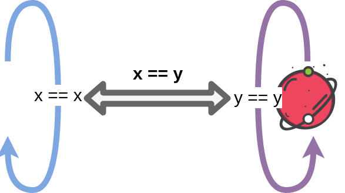
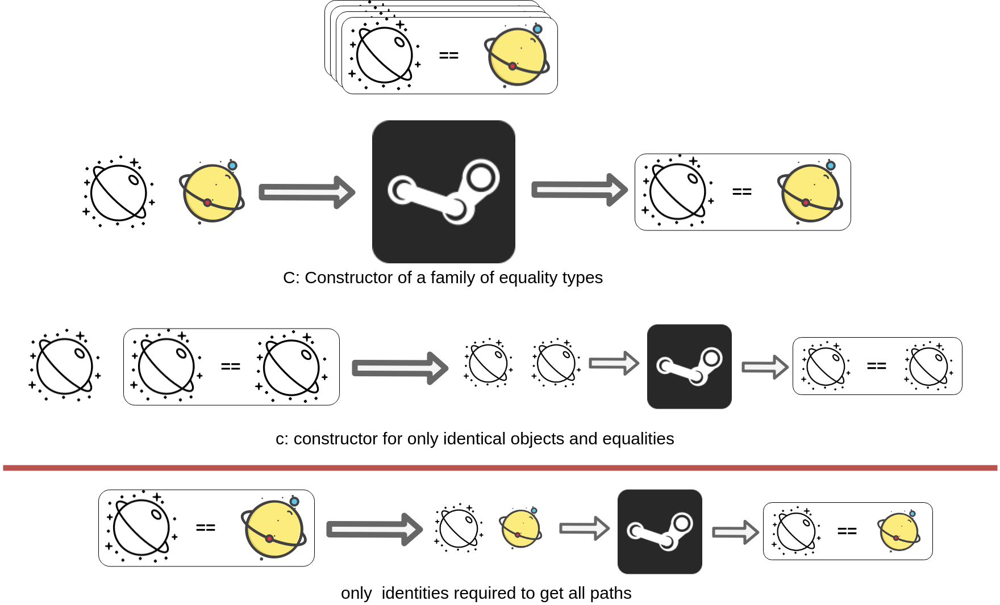

****
[Contents](contents.html)

<!-- START doctoc generated TOC please keep comment here to allow auto update -->
<!-- DON'T EDIT THIS SECTION, INSTEAD RE-RUN doctoc TO UPDATE -->
****

- [The Identity Type or Path](#the-identity-type-or-path)
  - [Path Induction](#path-induction)
  - [Dependent Paths](#dependent-paths)
  - [API](#api)
    - [Composition](#composition)
    - [Associativity](#associativity)
    - [Inverse](#inverse)

<!-- END doctoc generated TOC please keep comment here to allow auto update -->


# The Identity Type or Path

```agda
module HoTT.identity where

open import Agda.Primitive using (Level; _⊔_; lsuc; lzero)

open import Types.typeBasics using (Σ; _,_; fst; snd)
```

Identity types in type theory are the type of all equality types. An equality type between `x, y ∈ A` can be considered as a path from `x` to `y`. All of such paths share a relation amongst each other.

```agda
data Identity {ℓ} {A : Set ℓ} (x : A) : A → Set ℓ where
  identity : Identity x x
```

Identity types are also known as `Path`s.

```agda
Path = Identity
```

We define equality itself as a path:


```agda
_==_ : ∀ {ℓ} {A : Set ℓ} → A → A → Set ℓ
_==_ = Path
```

This forms the base of HoTT wherein we rebuild pretty much everything on the above structure.

## Path Induction



An inductive type is a type with a recursive constructor that can be used to successvely obtain elements of that type. However, though this definition "generally" works, there are more technical ones available [here for example](https://github.com/HoTT/book/issues/460).

The family of identity types is freely generated from elements of the form `identity: x == x`. Such a family's constructor is a dependent type `C : {x y : A} → x == y → Set ℓ₂`, which depends on two objects `x` and `y` of type `A` and an equality type or path between the two objects, can also be written as $Π(x, y, x ==_A y)$. Let `c` be a function that applies an object `x` to the constructor `C` and its `identity` equality type to obtain the path from `x → x`.

```agda
path-induction : ∀ {ℓ₁ ℓ₂} {A : Set ℓ₁}
        (C : {x y : A} → x == y → Set ℓ₂)
        → (c : (x : A) → C {x} {x} identity)
        → ({x y : A} (p : x == y) → C p)
path-induction C c {x} identity = c x

path-induction⁻¹ : ∀ {ℓ₁ ℓ₂} {A : Set ℓ₁}
        (C : {x y : A} → y == x → Set ℓ₂)
        → (c : (x : A) → C {x} {x} identity)
        → ({x y : A} (p : y == x) → C p)
path-induction⁻¹ C c {x} identity = c x
```

```agda
path-induction-v2 : ∀ {ℓ₁ ℓ₂} {A : Set ℓ₁}
        (C : {x y : A} → Path x y → Set ℓ₂)
        → (c : (x : A) → C {x} {x} identity)
        → ({x y : A} (p : Path x y) → C p)
path-induction-v2 C c {x} identity = c x

path-induction-v2⁻¹ : ∀ {ℓ₁ ℓ₂} {A : Set ℓ₁}
        (C : {x y : A} → Path y x → Set ℓ₂)
        → (c : (x : A) → C {x} {x} identity)
        → ({x y : A} (p : Path y x) → C p)
path-induction-v2⁻¹ C c {x} identity = c x
```


<!--  -->

This induction property could also be interpreted as, for an inductively defined identity type family, the entire family can be completely specified with just the elements `identityₓ`. Thus, since C(x, x) holds on all x ∈ A, if we are given x == y, then C(x, y) must hold. Getting the understanding of the induction principle can be tricky as the ideas around it are still in argument / development. Here are a few resources [1](https://planetmath.org/1121pathinduction) [2](https://math.stackexchange.com/questions/1667582/how-am-i-to-interpret-induction-recursion-in-type-theory) [3](https://cs.stackexchange.com/questions/28701/is-path-induction-constructive?newreg=3d0d333631c24ef0a8737f6072c14278).

## Dependent Paths

A dependent path describes the notion of equality preserving functions. It states that given a dependent type $Π(a, b)$ and the equality type between them, there exists a path $F(a) → F(b)$.


```agda
DependentPath : ∀ {i j} {A : Set i} {x y : A}
  → (F : A → Set j)
  → (p : x == y)
  → (a : F x)
  → (b : F y)
  → Set j
DependentPath F identity a b = (a == b)
```

## API

### Composition

Paths can be composed or concatenated (both from left and right):

```agda
_∘_ : ∀ {ℓ} {A : Set ℓ} {x y z : A}
        → (x == y)
        → (y == z)
        → (x == z)
identity ∘ k = k
```

```agda
_∘ₗ_ : ∀ {ℓ} {A : Set ℓ} {x y z : A}
        → (x == y)
        → (y == z)
        → (x == z)
k ∘ₗ identity = k
```

The above concatenations imply the same thing:

```agda
path-concat-equals-left : ∀ {ℓ} {A : Set ℓ} {x y z : A}
        → (a : x == y)
        → (b : y == z)
        → Identity (a ∘ b) (a ∘ₗ b)
path-concat-equals-left identity identity = identity

path-concat-equals-right : ∀ {ℓ} {A : Set ℓ} {x y z : A}
        → (a : x == y)
        → (b : y == z)
        → Identity (a ∘ₗ b) (a ∘ b)
path-concat-equals-right identity identity = identity
```

### Associativity

Path concatenation is associative:

```agda
path-concat-assoc : ∀ {ℓ} {A : Set ℓ} {w x y z : A}
        → (a : w == x)
        → (b : x == y)
        → (c : y == z)
        → Identity ((a ∘ b) ∘ c) (a ∘ (b ∘ c))
path-concat-assoc identity identity identity = identity
```

and similar for left and mixed `∘` and `∘ₗ` cases.

### Inverse

As paths are identities, they also have inverses. For every type `A` and every `x, y ∈ A`, there exists a function:

$f : (x == y) → (y == x)$

```agda
_⁻¹ : ∀ {ℓ} {A : Set ℓ} {x y : A}
        → (x == y)
        → (y == x)
identity ⁻¹ = identity
```

****
[Back to Contents](./contents.html)

