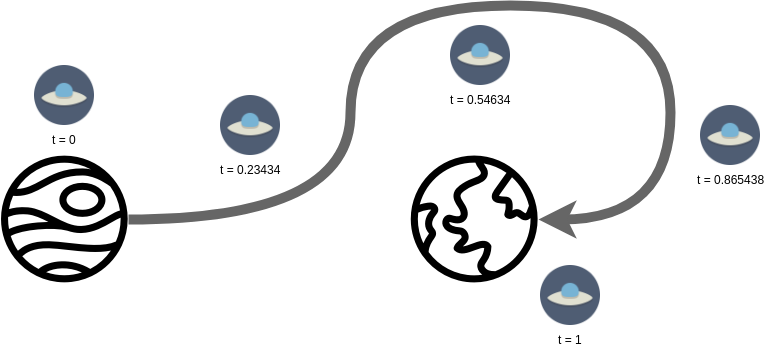

<!-- START doctoc generated TOC please keep comment here to allow auto update -->
<!-- DON'T EDIT THIS SECTION, INSTEAD RE-RUN doctoc TO UPDATE -->
****

- [Homotopy Type Theory](#homotopy-type-theory)
- [Homotopy Theory](#homotopy-theory)
  - [Fields, Spaces, Points, Paths](#fields-spaces-points-paths)
  - [Paths and their equalities](#paths-and-their-equalities)
    - [Homotopy](#homotopy)
    - [Fundamental group](#fundamental-group)
    - [∞-groupoid](#%E2%88%9E-groupoid)
  - [Induction principle](#induction-principle)

<!-- END doctoc generated TOC please keep comment here to allow auto update -->


# Homotopy Type Theory

```agda
module HoTT.introduction where
```

Homotopy type theory (HoTT) is a mathematical framework that treats types as spaces and one can apply the machinery of homotopy theory over those spaces. Homotopy theory is a part of algebraic geometry which deals with paths and functions between paths. HoTT essentially enables one to use the API of homotopy theory by letting us treat types as spaces. This allows us to implement homotopy theory using type theory in agda while connecting vast areas of mathematics. We see a glimpse of the entire structure here and then proceed to tackle each one individually in agda.

# Homotopy Theory

## Fields, Spaces, Points, Paths

A field (more force-field than data field) is a set of objects that support or permit addition, subtraction, division and multiplication. Real numbers, rational numbers and complex numbers are some such "set of objects" which we use widely and which can form fields.

An n-dimensional space can be thought as a collection of n numbers from a field and n directions or bases. Thus we can construct spaces from fields. For e.g. any point in 2-dimensional space of real numbers ℝ can be represented as $a × x + b × y$ where $a, b ∈ ℝ$.

A path is a line joining two points. This path can be of any shape, be it a straight line or an extremely squiggly one.



## Paths and their equalities

Technically, a path p between two points `x` and `y` can be represented as a function `f` that takes a continuous value `t` and returns a point on the path `f(t)` such that the first point is `x` $f(0) = x$ and the last point is `y` $f(1) = y$ and $0 ≤ t ≤ 1$. It might need to be reminded that such a path might not actually exist as a continuous line through space but may help if imagined as such.

Now, we could take any two paths between the same points and stretch / squeeze one path into another. This process can be used to capture relationships between two paths and is called *homotopy*. More formally,


### Homotopy

A *homotopy* between two paths `p(t)` and `q(t)` is defined as a continuous function `H(t, h)` such that:

- $H(t, 0) = p(t)$
- $H(t, 1) = q(t)$
- $H(0, h) = x$
- $H(1, h) = y$

There can exist multiple paths between two objects and hence multiple homotopies between them. Homotopies can be thought of as 2-dimensional paths or path-of-path if paths are 1-dimensional paths. Homotopies are built on equivalence relations and hence fit into its API, i.e. homotopy respects reflexivity, symmetry and transitivity,  and can be used to build equational reasoning chanins.


### Fundamental group

Two homotopies `H1` and `H2` can themselves be called equal if $H(0, h) = H(1, h) = x₀$, i.e. if `x` and `y` are the same point. We can use this equivalence relation and the fact that homotopies have inverses, to build a group structure around these homotopies, called as the *fundamental group*.

### ∞-groupoid

We can have n-dimentional paths from n-equalitites or homotopies of homotopies of homotopies of homotopies and so on. Such a structure of infinite levels of homotopies with points followed by paths as base is called the *∞-groupoid*. Every space can be turned into its ∞-groupoid and then homotopy theory can be applied to it as well as every ∞-groupoid can yield a fundamental group. This fact connects algebraic topology (which uses the fundamental group) and category theory (which builds on the ∞-groupoid).

In HoTT, each type can be represented as an ∞-groupoid. Each pair of objects `x` and `y` of a type can have an typelevel equality type $x ≡_A y$. For example in python:

```python
a = 3
b = 4

type(a) ≡ type(b)
```

These equalities can have further equalities $(x_1 ≡_A y_1) ≡_{(x ≡_A y)} (x_2 ≡_A y_2)$. Note: higher levels cannot be done trivially in python.

## Induction principle

The induction principle is central to deriving all basic constructions for HoTT. Stated simply, if for every pair of objects `x` and `y` of type `A`
- the equality type $≡_A$ between `x` and `y` exists everytime `x` and `y` are equal
- for every `x ∈ A`, the equalities $x ≡_A x$ are reflexive
then for a proposition `C` which depends upon the equality $x ≡_A y$, it turns out that it is sufficient to prove `C` for all cases where $x ≡_A x$ alone and it becomes automatically applicable for cases for all $x ≡_A y$.


****
[Back to Contents](./contents.html)
