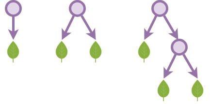
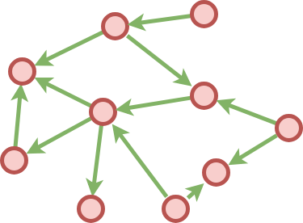

****
[Contents](contents.html)
[Previous](Lang.intro.html)
[Next](Lang.functions.html)

<!-- START doctoc generated TOC please keep comment here to allow auto update -->
<!-- DON'T EDIT THIS SECTION, INSTEAD RE-RUN doctoc TO UPDATE -->
****

- [Data Structures](#data-structures)
  - [Types](#types)
  - [`Data` keyword](#data-keyword)
  - [Functions](#functions)
  - [Trivial Types](#trivial-types)
    - [Empty](#empty)
    - [Singleton](#singleton)
  - [Boolean type](#boolean-type)
  - [Natural numbers](#natural-numbers)
  - [Binary Trees](#binary-trees)
  - [Graph](#graph)
  - [List](#list)
  - [Finite set](#finite-set)
  - [Indexed sequences or Vectors](#indexed-sequences-or-vectors)

<!-- END doctoc generated TOC please keep comment here to allow auto update -->

Learning a new programming language usually consists of learning two basic things first:
1. Data structures and their APIs
2. Control logic (if/else, loops - for, while, do-while etc)

In a similar fashion, we take a look at how to construct familiar data structures first.

# Data Structures

```agda
module Lang.dataStructures where

open import Agda.Builtin.Nat public using (Nat)
```

## Types

Agda is an implementation of type theory, a branch of mathematics which deals with `Type` as an object and various theorems (APIs) for working with `Type`s. A `Type` presents a notion of an object of a certain kind, i.e. it assigns some extra information to an object.

Programmers might already be well familiar with the notion of `Type` as it's use is widespread in programming.

In Type theory, we declare `A` as a type:

$$
A : Type
$$

and say the object `x` is of type `A` like:

$$
x : A
$$

This, in say scala is done like:

```scala
val x:Int = 0
```

or in C:

```c
int x;
```

in Agda:

```agda
variable
  x : Nat
```

The `Set` type is the root of all types, somewhat akin to java's `Object` or scala's `Any`. Every other Type is a `Set`, whereas `Set` itself if of type `Set : Set₁`. We will look deeper into this at a later stage.

## `Data` keyword

Programming languages often come bundled with some primitive data types like `int`, `float`, `string` etc and some that combine these primitive types into more complex structures, e.g. `map` or `dict` (python) can be used to construct say `map<string, array<string>>` or the `Either` datatype in haskell, the `Option` datatype in scala, `tuple` in python and so on.

Some languages also provide the mechanism to define new data types, sometimes by alias-ing a data type with a name like in scala:

```scala
type newData = Map[String, List[Float]]
```

This is called `type aliasing`.

Others provide the facility to define completely new data types, like haskell does with the `data` keyword:

```haskell
-- this states that the type `Bool` can have two values False and True
data Bool = False | True
```

A haskell datatype can also have constructors. For e.g. if we were to define a shape type which can either be a circle or a rectangle:

```haskell
data Shape = Circle Float Float Float | Rectangle Float Float Float Float

-- uses the Circle constructor to create an object of type Shape
Circle 1.2 12.1 123.1

-- uses the Rectangle constructor to create an object of type Shape
Rectangle 1.2 12.1 123.1 1234.5
```

It is important to appreciate that `Shape` is a new `Type`, one that did not previously exist before in the language.

The `data` keyword works in a similar manner in Agda:

```agda
-- lets assume SomeType1 and SomeType2 to be previously defined
module _ {SomeType1 SomeType2 : Set} where

  data AgdaData : Set where
    -- constructors, all return AgdaData
    constructor1 : SomeType1 → AgdaData
    constructor2 : SomeType2 → AgdaData
    trivialConstructor : AgdaData
    etc : SomeType1 → SomeType2 → AgdaData
```

## Functions

In Type theory, a function `f` that operates on values of type `𝔸`, also called domain of the function and produces values of type `𝔹` is represented as:

$$
f : 𝔸 → 𝔹
$$

A function in Agda consists of two main parts:
1. Types that the function operates on including:
   1. Domain `Type`.
   2. Co-domain `Type`.
2. Clauses − each clause applies to a pattern of argument.

```haskell
not : Bool → Bool
not true  = false
not false = true
```

This is something to be aware of at this time, though we will look at much more complex examples of functions as we go on. As Agda is implemented in haskell, this is very similar to haskell syntax.

## Trivial Types

### Empty

An empty type cannot be created cause it has no constructor. This is the most barebones of a `data` definition.

```agda
data ⊥ : Set where
```

### Singleton

A singleton is just a type containing only one object:

```agda
data ⊤ : Set where
  singleton : ⊤
```

The singleton constructor `singleton` creates a single object of type `T`.

## Boolean type

The boolean type has just two values:

```agda
data Bool : Set where
  true : Bool
  false : Bool
```

## Natural numbers

Natural numbers are the integral numbers used for counting, e.g. 0,1,2,3... Natural numbers support an operation called `succ` for succession, which can be used to create new natural numbers from known ones, e.g. `3 = 2 + 1 = 1 + 1 + 1`. Thus, all natural numbers can be created from `zero` and n successive numbers after `zero`. All we need to know are:

- zero
- how to increment a given number

and then, increment zero to infinity!

```agda
data ℕ : Set where
  zero : ℕ
  succ : ℕ → ℕ
```

The operations for natual numbers, addition, subtraction, multiplication and powers can be defined as functions in Agda:

```agda
_+_ : ℕ → ℕ → ℕ
x + zero = x
x + (succ y) = succ (x + y)

_−_ : ℕ → ℕ → ℕ
zero  − m     = zero
succ n − zero  = succ n
succ n − succ m = n − m

_×_ : ℕ → ℕ → ℕ
x × zero     = zero
x × (succ y) = x + (x × y)

_² : ℕ → ℕ
x ² = x × x

_^_ : ℕ → ℕ → ℕ
x ^ zero = succ zero
x ^ (succ y) = x × (x ^ y)
```

Examples:

```agda
one   = succ zero
two   = succ one
three = succ two
four  = succ three
five  = succ four
six   = succ five
seven = succ six
eight = succ seven
nine  = succ eight
ten   = succ nine
```

and so on. Here, each member of the integer family can be derived from a smaller member by successively applying `succ` to it. Such a type is called an [**Inductive** type](https://en.wikipedia.org/wiki/Agda_(programming_language)#Inductive_types).

Also note that in the function `_+_`, we used a new kind of clause:

```haskell
x + (succ y) = succ (x + y)
```

Here, we mean that for all inputs of the type `x + (succ y)` where `succ y` corresponds to a natural number that has been constructed using a `succ` i.e. it is `(succ y) > 0`, return `succ (x + y)`. This pattern is called "pattern matching". Pattern matching is heavily used all over the functional programming world, e.g. in scala:

```scala
(1 to 100).map{
  // pattern match against all values of type integer
  case(y:Int) if y > 5 =>
    y+1
  // if above pattern does not match
  case _ =>
    0
}
```

## Binary Trees

We define a binary tree using the following definition. Note that this merely creates an empty structure of a tree, the nodes or leaves contain no information in them, except for their position in the tree:



```agda
data BinTree : Set where
  leaf : BinTree
  node : BinTree → BinTree → BinTree
```

Now let us augment the binary trees with leaves containing natural numbers in leaf nodes:

```agda
data ℕBinTree : Set where
  leaf : ℕ → ℕBinTree
  node : ℕBinTree → ℕBinTree → ℕBinTree
```

Binary trees with each node and leaf containing a natural number:

```agda
data ℕNodeBinTree : Set where
  leaf : ℕ → ℕNodeBinTree
  node : ℕ → ℕNodeBinTree → ℕNodeBinTree → ℕNodeBinTree
```

Binary trees with each node containing a natural number and each leaf contaning a boolean:

```agda
data ℕMixedBinTree : Set where
  leaf : Bool → ℕMixedBinTree
  node : ℕ → ℕMixedBinTree → ℕMixedBinTree → ℕMixedBinTree
```

## Graph



We define a graph with:

- Vertices containing a natural number
- Edges as triples containing `to` and `from` vertices

```agda
data Vertex : Set
data Edge   : Set
data Graph  : Set

data Vertex where
  vertex : ℕ → Vertex

data Edge where
  edge : Vertex → Vertex → Edge

data Graph where
  idGraph : Edge → Graph
  _+|+_ : Graph → Edge → Graph

infixl 3 _+|+_
```

Agda supports ["mixfix"](https://agda.readthedocs.io/en/v2.5.2/language/mixfix-operators.html) operators which combine infix, prefix and postfix operator semantics. Operator arguments are indicated with underscores `_`. An example would be the infix addition operator `_+_` which when applied with two parameters can be written as `a + b`. Similarly, a prefix operator would be represented as `♠_`, a postfix one as `♠_`. It is also possible to define more complex operators like `if_then_else_`.

The `infixl` operator above sets the precedence of the operator `+|+`.

We can use the above definition to create a graph in the following way:

```agda
graph : Graph
graph = idGraph (edge (vertex zero)   (vertex seven))     +|+
                edge  (vertex one)    (vertex three)      +|+
                edge  (vertex seven)  (vertex four)       +|+
                edge  (vertex nine)   (vertex (succ six))
```

## List


A list containing objects of type `A` can be defined inductively as having:

- An identity element, i.e. an empty list `[]`
- A concat operator which successively creates bigger lists `::`

```agda
data List (A : Set) : Set where
  [] : List A
  _::_ : A → List A → List A

infixr 5 _::_
```

and we create instances of lists as:

```agda
bunch : List Bool
bunch = false :: false :: true :: false :: true :: []
```

```agda
data TypeOf (A : Set) : Set where
  typeOf : List A → TypeOf A
```

```agda
nat : TypeOf ℕ
nat = typeOf ( one :: two :: ten :: [] )
```

## Finite set

A finite set can be considered as a finite bunch of numbered objects, such that each object can be uniquely identified by an integer, thus making the set countable. This count is called the `Cardinality` of the set. Formally, a finite set `Fin` is a set for which there exists a bijection (one-to-one and onto correspondence) $f : Fin → [n]$ where $n ∈ ℕ$ and `[n]` is the set of all natural numbers from `0` to `n`.

```agda
data Fin : ℕ → Set where
  id : (n : ℕ) → Fin (succ n)
  succ : (n : ℕ) → Fin n → Fin (succ n)
```

`Fin n` represents the set of first n natural numbers, i.e., the set of all numbers smaller than n. We create a finite set of four elements:

```agda
fourFin : Fin four
fourFin = succ three (succ two (succ one (id zero)))
```

For a more in-depth treatment of finite sets, refer [Dependently Typed Programming with Finite Sets](http://firsov.ee/finset/finset.pdf).

## Indexed sequences or Vectors


We now define a finite sized indexed list, also called a vector `Vec`. The constructor consists of:

- An identity constructor, `[]` which constructs an empty vector
- A successive constructor `cons` which inductively builds a vector

```agda
data Vec (A : Set) : ℕ → Set where
  [] : Vec A zero
  cons : (n : ℕ) → A → Vec A n → Vec A (succ n)
```

Examples of vectors :

```agda
vec1 : Vec Bool one
vec1 = cons zero true []

vec2 : Vec Bool two
vec2 = cons one false vec1

vec3 : Vec Bool three
vec3 = cons two true vec2
```

Note that each vector has its size encoded into it's type. This is not to be confused with set theory based lists, where any two list of different number of elements have the same type.

For example:

```scala
val x : List[Int] = List(1,2,3,4,5)
val y : List[Int] = List(1,2,3,4,5,6,7,8,9,0)
```

both have the same type `List[Int]`.

Example, a bool-indexed vector such that only one type can be stored at the same time:

```agda
data ⟂ : Set where

data BoolVec(A B : Set) : Bool → Set where
  id₁ : B → BoolVec A B false
  id₂ : A → BoolVec A B true

containsB : BoolVec ⟂ ℕ false
containsB = id₁ three

containsA : BoolVec ℕ ⟂ true
containsA = id₂ four
```

****
[Functions](./Lang.functions.html)
