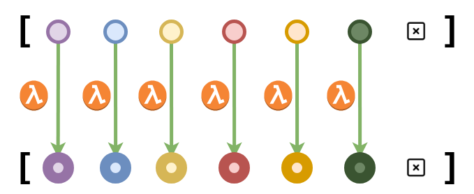

****
[Contents](contents.html)
[Previous](Lang.dataStructures.html)
[Next](Lang.other.html)

<!-- START doctoc generated TOC please keep comment here to allow auto update -->
<!-- DON'T EDIT THIS SECTION, INSTEAD RE-RUN doctoc TO UPDATE -->
****

- [Functions](#functions)
  - [Pattern matching functions](#pattern-matching-functions)
    - [The Logical Not](#the-logical-not)
    - [The logical AND](#the-logical-and)
    - [The logical OR](#the-logical-or)
  - [Recursive functions](#recursive-functions)
    - [Addition of natural numbers](#addition-of-natural-numbers)
- [Examples](#examples)
  - [List concatenation](#list-concatenation)
  - [Length](#length)
  - [Map](#map)

<!-- END doctoc generated TOC please keep comment here to allow auto update -->


# Functions

A function `𝕗` which takes a value of type `𝔸` and returns a value of type `𝔹`, is said to be of type `𝔸 → 𝔹` and is written as `𝕗 : 𝔸 → 𝔹`. The type `𝔸` is called the function `𝕗`'s "domain" and `𝔹` is the "co-domain". Functions are allowed to be recursive, in fact, in Agda we make heavy use of recursion and pattern matching while defining functions.

```agda
module Lang.functions where

open import Lang.dataStructures renaming (_+_ to _⨦_)
```

Following are a few examples of functions:

## Pattern matching functions

### The Logical Not

The simplest of functions simply match patterns. For example the function for `not`:

```agda
not : Bool → Bool
not true = false -- return false if we are given a true
not false = true -- return a true if we are given a false
```

we could also use wildcard type like this:

```agda
not₁ : Bool → Bool
not₁ true = false -- return false if we are given a true
not₁ _ = true -- return true in all other cases
```

### The logical AND

```agda
_∧_ : Bool → Bool → Bool
true ∧ whatever = whatever -- true AND whatever is whatever
false ∧ whatever = false -- false AND whatever is false

infixr 6 _∧_
```

### The logical OR

```agda
_∨_ : Bool → Bool → Bool
true ∨ whatever = true -- true or whatever is true
false ∨ whatever = whatever -- false or whatever is whatever

infixr 6 _∨_
```

These functions can be applied as:

```agda
notTrue : Bool
notTrue = not true

false₁ : Bool
false₁ = true ∧ false

true₁ : Bool
true₁ = true ∨ false ∨ false₁
```

## Recursive functions

### Addition of natural numbers

Here we follow a similar pattern as in `data`, we define:

- the identity condition, what happens on addition with zero in this case
- and how to successively build up the final value

```agda
_+_ : ℕ → ℕ → ℕ
zero + n = n
succ m + n = succ (m + n)

infixl 6 _+_
```
Thus, we can use them to get new numbers easily:

```agda
eleven = ten + one
twelve = eleven + one
thirteen = twelve + one
```

# Examples

## List concatenation

Functions in Agda can take types as parameters such that the function can work on all higher types of that type parameter. This function takes a type as a parameter `A`, and hence can work on `List`s of any type `A`.

```agda
_++_ : {A : Set} → List A → List A → List A
[]        ++ ys = ys
(x :: xs) ++ ys = x :: (xs ++ ys)

infixr 5 _++_
```

This feature of functions is called "parametric polymorphism". This function works on higher levels of abstraction, i.e. on all list types.

Note that the curly braces `{}` are called "implicit arguments" in Agda. Values of implicit arguments are derived from other arguments' values and types by solving type equations. You don’t have to apply them or pattern match on them explicitly (though they can be explicitly stated like `{A = A}`).

## Length

The length of a list consists of traversing through the list and adding one for each element:

```agda
length : List ⊤ → ℕ
length [] = zero
length (x :: xs) = one + (length xs)
```

## Map

We implement the `map` function, of "map-reduce" fame, for `List`s:
A map function for a `List` is a function that applies a lambda (un-named) function to all elements of a `List`.

If `f` were a lambda function, map-ing `f` over `List(a, b, c, d)` would produce `List(f(a), f(b), f(c), f(d))`



```agda
map : {A B : Set} → List A → (A → B) → List B
map [] f = []
map (x :: xs) f = (f x) :: (map xs f)
```

Here, we apply the function `addOne` to a list, using `map`:

```agda
addOne : ℕ → ℕ
addOne x  = x + one

oneAdded : List ℕ
oneAdded = map (one :: two :: three :: four :: []) addOne
```


****
[Modules, Records and Postulates](./Lang.other.html)
