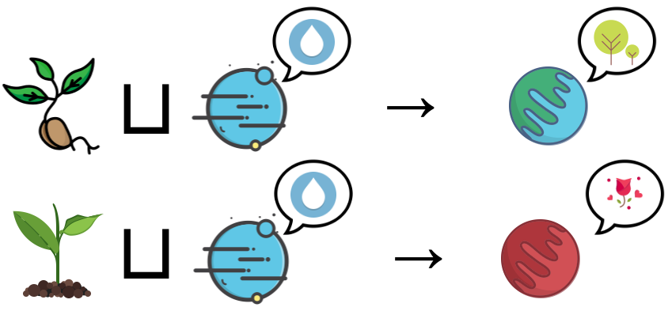

****
[Contents](contents.html)

<!-- START doctoc generated TOC please keep comment here to allow auto update -->
<!-- DON'T EDIT THIS SECTION, INSTEAD RE-RUN doctoc TO UPDATE -->
****

- [Functions](#functions)
- [Dependent Function Types or Π-types](#dependent-function-types-or-%CF%80-types)
  - [Construction](#construction)
- [Properties of function types](#properties-of-function-types)
  - [Function composition](#function-composition)
  - [Identity and constant functions](#identity-and-constant-functions)
  - [Application](#application)
  - [Currying](#currying)
  - [Infix application](#infix-application)
  - [Other useful API](#other-useful-api)
    - [Flip](#flip)
    - [On](#on)
    - [Type extractor](#type-extractor)
    - [Case statements](#case-statements)

<!-- END doctoc generated TOC please keep comment here to allow auto update -->

# Functions

```agda
module Types.functions where

open import Lang.dataStructures using (
  Bool; true; false;
  ℕ; List;
  one; two; three; four; five; six; seven; eight; nine; ten; zero; succ;
  _::_; [];
  ⊤; singleton; ⟂)

open import Agda.Primitive using (Level; _⊔_; lsuc)

open import Types.product using (Σ; _,_; fst; snd)
```

We have previously looked at how [functions are defined in Agda](Lang.functions.html). Here we will look at some abstract representations of functions and their properties.

A unary function is defined as:

```agda
Fun₁ : ∀ {i} → Set i → Set i
Fun₁ A = A → A
```

and a binary one as:

```agda
Fun₂ : ∀ {i} → Set i → Set i
Fun₂ A = A → A → A
```
In Type Theory, a function is also a type, called a **function type** represented as the type `Input₁ → Input₂ → ... → Inputₙ → Output`, where `Inputᵢ` are the input types and `Output` is the output type. A function type `f : A → B` can also be considered to be an exponential `f : Bᴬ` and can be thought of as belonging to the set of all `b ∈ B` that can be obtained from any `a ∈ A`, hence `Bᴬ` such elements. 

The concept of **currying** can be explained using this representation as $C^{A × B} = (C^A)^B$  hence a function taking multiple arguments `f : (A, B) → C` is the same as `f : A → B → C`. **Partial functions** can then be trivally described as functions that return functions with lesser number of arguments, or **arity**: `∀ a ∈ A, g = f(a) : B → C`.

# Dependent Function Types or Π-types

Dependent function types or Π-types are functions whose type of second argument depends upon the type of first.

i.e. function `f : A → (g A) → Set` where `g : A → B`.

In the notation of lambda abstraction:

$$
λx. (λx.y).ϕ
$$

Another notation is to use $\Pi_{x : A} B(x)$, mostly used in type theory to denote Π-types. Functions of higher arity then take the form $\Pi_{x : A}\Pi_{y : B(x)} D(y)$ and so on.



To show how to use this type, we construct an example:

```agda
-- divide by 2
divBy2 : ℕ → ℕ
divBy2 zero = zero
divBy2 (succ zero) = one -- well...
divBy2 (succ (succ n)) = succ (divBy2 n) -- take 2 at a time and count as 1

-- proof of a number being even
even : ℕ → Set
even zero = ⊤
even (succ zero) = ⟂
even (succ (succ n)) = even n
```

Now, we can define a function that divides only even numbers by 2:

```agda
divBy2₂ : (n : ℕ) → even n → ℕ
divBy2₂ zero p = zero
divBy2₂ (succ zero) ()
divBy2₂ (succ (succ y)) p = succ (divBy2₂ y p)
```

In order to be applied, `divBy2₂` requries its input `n` to conform to the type `even n`, which can only exist if the number `n` is even! This makes `divBy2₂` a dependent function.

## Construction

A dependent Π-type can be constructively defined as:

```agda
Π : ∀ {i j} (A : Set i) (P : A → Set j) → Set (i ⊔ j)
Π A P = (x : A) → P x
```

# Properties of function types

## Function composition

A function composition is defined as:

```agda
_∘_ : ∀ {a b c} {A : Set a} {B : A → Set b} {C : {x : A} → B x → Set c}
        → (g : {x : A} (y : B x) → C y)
        → (f : (x : A) → B x)
        → ((x : A) → C (f x))
g ∘ f = λ x → g (f x)

_∘′_ : ∀ {a b c} {A : Set a} {B : Set b} {C : Set c}
        → (B → C)
        → (A → B)
        → (A → C)
f ∘′ g = _∘_ f g
```

and specifically for dependent types:

```agda
_○_ : ∀ {a b c} {A : Set a} {B : A → Set b} {C : (x : A) → B x → Set c}
        → (g : {x : A} → Π (B x) (C x))
        → (f : Π A B)
        → Π A (λ x → C x (f x))
g ○ f = λ x → g (f x)
```

Going further, we define our machinery on all functions, dependent or not. However, it is worth nothing that by functions, we mean **pure functions**, i.e. without any side effects, for example IO, state manipulation, etc.

## Identity and constant functions

```agda
id : ∀ {a} {A : Set a} → A → A
id x = x

const : ∀ {a b} {A : Set a} {B : Set b} → A → B → A
const x = λ _ → x
```

## Application

A function application is a type which actually applies a bunch of arguments to a function.

```agda
_$_ : ∀ {a b} {A : Set a} {B : A → Set b}
        → ((x : A) → B x)
        → ((x : A) → B x)
f $ x = f x
```

## Currying

Currying, as we saw earlier, converts a function that takes multiple arguments into a sequence of functions each taking one argument. Un-currying is the opposite of currying. We define both for binary functions, though further extensions are trivial:

```agda
curry : ∀ {i j k} {A : Set i} {B : A → Set j} {C : Σ A B → Set k}
        → (∀ s → C s)
        → (∀ x y → C (x , y))
curry f x y = f (x , y)

uncurry : ∀ {i j k} {A : Set i} {B : A → Set j} {C : ∀ x → B x → Set k}
        → (∀ x y → C x y)
        → (∀ s → C (fst s) (snd s))
uncurry f (x , y) = f x y
```

## Infix application

```agda
_⟨_⟩_ : ∀ {a b c} {A : Set a} {B : Set b} {C : Set c}
        → A
        → (A → B → C)
        → B
        → C
x ⟨ f ⟩ y = f x y
```

## Other useful API

### Flip

```agda
flip : ∀ {a b c} {A : Set a} {B : Set b} {C : A → B → Set c}
        → ((x : A) (y : B) → C x y)
        → ((y : B) (x : A) → C x y)
flip f = λ y x → f x y
```

### On

```agda
_on_ : ∀ {a b c} {A : Set a} {B : Set b} {C : Set c}
        → (B → B → C)
        → (A → B)
        → (A → A → C)
_*_ on f = λ x y → f x * f y
```

### Type extractor

```agda
typeOf : ∀ {a} {A : Set a} → A → Set a
typeOf {A = A} _ = A
```

### Case statements

```agda
infix 0 case_return_of_ case_of_

case_return_of_ :
  ∀ {a b} {A : Set a}
  (x : A) (B : A → Set b) → ((x : A) → B x) → B x
case x return B of f = f x

case_of_ : ∀ {a b} {A : Set a} {B : Set b} → A → (A → B) → B
case x of f = case x return _ of f
```

****
[Proofs as Data](./Types.proofsAsData.html)
