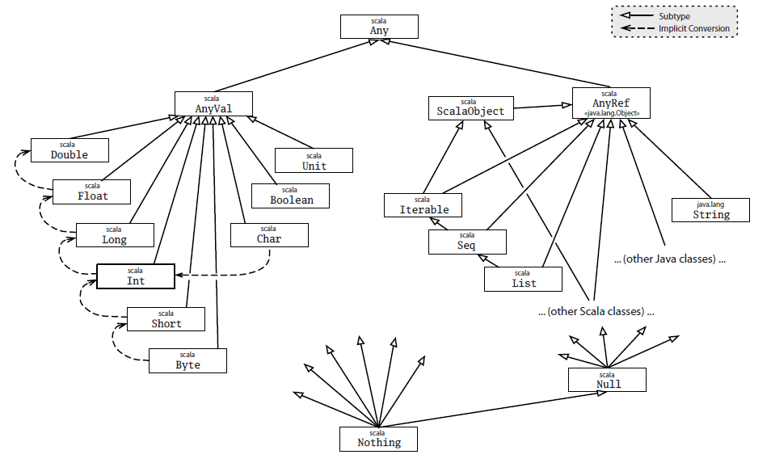

<!-- START doctoc generated TOC please keep comment here to allow auto update -->
<!-- DON'T EDIT THIS SECTION, INSTEAD RE-RUN doctoc TO UPDATE -->
****

- [Introduction](#introduction)
  - [The scala type system](#the-scala-type-system)
  - [Judgements and Propositions](#judgements-and-propositions)
- [The Bottom type](#the-bottom-type)

<!-- END doctoc generated TOC please keep comment here to allow auto update -->


# Introduction

```agda
module Types.introduction where

open import Lang.dataStructures using (List; []; _::_; ℕ; one; three; seven; nine)
```

Set theory is a formal system of mathematics which serves as a language for constructing and studying collections of objects as sets. Much of mathematics and computer science fundamentals has been built upon the foundations of set theory as the reader is assumed to have encountered. In its infancy, set theory faced certain technical challenges, called paradoxes, which were progressively removed and the theory refined to what is known today as Zermelo-Fraenkel Set theory (ZFC). An example of this is the Russell's paradox which is that the set of all sets cannot contain itself and hence is a paradox.

Type theory is an area of mathematics of direct consequence to programming. Type theory is about a class of formal systems, not much unlike type systems in programming languages. Bertrand Russell was the first to propose this theory in order to "fix" Russell's Paradox which plauged naive set theory, though Per Martin-Löf was the one to come up with a more useful version of it, called "intuitionistic type theory". This is what we will go through here.

A type system in programming languages typically specifies data and appears like a tree of objects, where each successive level tries to represent data more specifically. E.g., A `Float` is a subtype of `Number` and is a more specialized case of a numbers. However, in type theory, a "type" can essentially mean anything - from as general as the type of all types, to super specific, like the number 3. Hence everything, individual objects, sets or collections of objects, types in programming languages, entire programming langauge type systems, every logical statement, theorems, proofs, functions, any other mathematical object, even equality itself, are all "types".

## The scala type system



## Judgements and Propositions

The basic constructs of type theory as opposed to set theory is based on the concept of "judgement"s versus "proposition"s.

Zermelo-Frenkel Set theory (ZFC) consists of:

- `Set`s which are a collection of objects
- a propositional first order logic system to create and manipulate such objects and sets
- maps amongst such sets

which is in fact pretty much the basic components of any imperative programming language, with data types as collections or sets of objects, first order logic to construct such objects and functions to manipulate them.

However, the problem here is with `propositions` as in there can exist propositions which turn out to be false. However, types as objects serve as judgements. An object with type defined, say, `List A` fully specifies it, and can be type-checked by a first-order logic system for validity. In type theory, propositions are just another kind of types, and hence the judgement of a proposition being true relies on the fact that the proposition can be fully specified. Thus type theory eliminates the possibility of specifying something that can be disproven. Hence, whereas a proposition `prop` in set theory would require a proof to be proven later, and can turn out to be false, a proposition `prop : P` fully specified as type `P` requires a proof as part of its specification.

```agda
fullySpecified : List ℕ
fullySpecified = one :: three :: seven :: nine :: []
```

Thus, `fullySpecified` once specified, has already been proven and requires no proving. Hence it is a judgement, whereas something like `a ∈ ℕ` is a proposition, which needs a proof (for every given a of ∈ to ℕ).

In type theory, we cannot introduce a variable without specifying its type. Hence, everything becomes a judgement by default if it compiles, and by piling up these judgements we can prove theories, simply by constructing them as objects. This fundamental difference is what makes type theory more consistent and easier to use to construct higher mathematical structures on and moreso do it using better tools such as a programming language. Agda is a faithful implementation of type theory and hence functions as an effective tool to specify mathematics constructively.

# The Bottom type

The Bottom type in Agda, is akin to `Nothing` type in scala. As far as types are concerned, this indicates a never-ending computation.

The bottom type can be defined using either the `data` API or using `postulate`s:

```agda
data False : Set where
```

```agda
postulate bottom : False
```

```agda
data ⟂ : Set where
```

****
[Universes and families](./Types.universe.html)
