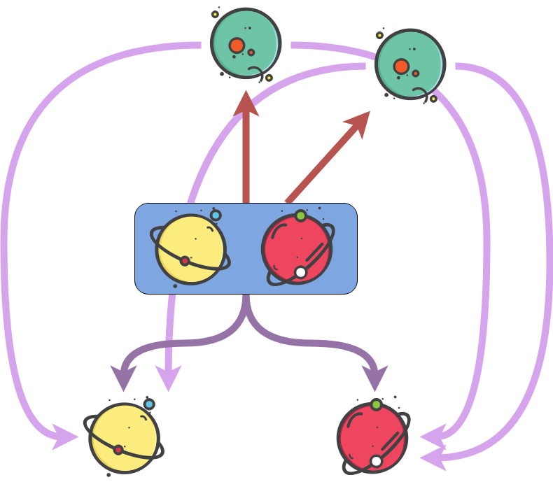

****
[Contents](contents.html)

<!-- START doctoc generated TOC please keep comment here to allow auto update -->
<!-- DON'T EDIT THIS SECTION, INSTEAD RE-RUN doctoc TO UPDATE -->
****

- [Product types](#product-types)
  - [Construction](#construction)
  - [Dependent Pair Types or Σ-types](#dependent-pair-types-or-%CF%83-types)
  - [API](#api)
    - [Cross product](#cross-product)
    - [Application of a product](#application-of-a-product)
    - [Map](#map)
    - [Swap](#swap)
- [Co-product types](#co-product-types)
  - [Maybe](#maybe)
  - [API](#api-1)
    - [Eliminator](#eliminator)
    - [Map](#map-1)
    - [Zip](#zip)

<!-- END doctoc generated TOC please keep comment here to allow auto update -->


```agda
module Types.product where

open import Lang.dataStructures using (
  Bool; true; false;
  ⊥; ⊤; singleton; ℕ; List;
  one; two; three; four; five; six; seven; eight; nine; ten; zero; succ;
  _::_; [])

open import Agda.Primitive using (Level; _⊔_; lsuc; lzero)
```

# Product types

A cartesian product of two types `A` and `B` can be defined as a pair of objects `(a, b)`, where `a` ∈ `A`, and `b` ∈ `B`.

```agda
data _××_ (A B : Set) : Set where
  _,,_  : A → B → A ×× B

infixr 4 _××_
```

and cartesian products constructed as

```agda
oneTwo = one ,, two

oneTwoThree = one ,, (two ,, three)
```

## Construction

While being intuitively familiar with what a cartesian product is, it's algebraic definition captures the most abstract aspect of a product:

A cartesian product, in set theory, for two sets `A` and `B` is defined as:

$$ A x B = \{ (a , b) | a ∈ A ~and~ b ∈ B \} $$

In  type theory, we look at another way of defining product types, just by looking at them as objects in themselves:
For an object `X`, we call `X` a product type if:

1. There exists two functions, lets call them `proj₁` and `proj₂` such that they can be used to "extract" the contents of the product `X`:

```haskell
proj₁ : {A B : Set} → (A × B) → A
(a × b) = a

proj₂ : {A B : Set} → (A × B) → B
(a × b) = b
```

2. If there is any another object `A`, such that the functions `proj₁ₐ` and `proj₂ₐ` satisfied the above condition for `A`, then there exists a function, `fₐ₀` such that:

```haskell
fₐ₀ : A → X
```

Note: The above is pseudo-code, the proof is below.

The second condition is the unique-ness condition, .i.e. for all objects having projections to `A` and `B`, there is one through which all projections go through. We call this one object the "Product" This is better visualized in this diagram:


## Dependent Pair Types or Σ-types

Dependent types are products where the 2nd type is dependent on the first one. i.e. `(A, B)` such that there exists.

Agda's `Record` types provides encapsulation for this definition and some syntactic sugars like constructors:

```agda
record Σ {a b} (A : Set a) (B : A → Set b) : Set (a ⊔ b) where
  constructor _,_
  field
    fst : A
    snd : B fst

open Σ public

infixr 4 _,_
```

While constructing algebraic structures, a fairly general pattern is that a bunch of properties can be bundled together to form objects, and then structures are built on top of them. Since all of those properties are types, a record containing a bunch of properties would by construction ensure the objects of such a record belong to the algebraic type. A lot of implementation of mathematical structures can be done in this form of `record`s of bundled properties.

The `Σ` type is also called a "Dependent" or "Σ" (sigma) type - dependent as in the second parameter to `record` depends upon the type `A`, the first parameter. Note that we use the machinery of universe polymorphism to define this.




## API

### Cross product

```agda
_×_ : ∀ {a b} (A : Set a) (B : Set b) → Set (a ⊔ b)
A × B = Σ A (λ x → B)
```

### Application of a product

```agda
<_,_> : ∀ {a b c} {A : Set a} {B : A → Set b} {C : ∀ {x} → B x → Set c}
        (f : (x : A) → B x)
        → ((x : A) → C (f x))
        → ((x : A) → Σ (B x) C)
< f , g > x = (f x , g x)
```

### Map

Mapping a pair of functions `f` and `g` over a product:

```agda
map : ∀ {a b p q} {A : Set a} {B : Set b} {P : A → Set p} {Q : B → Set q}
        → (f : A → B)
        → (∀ {x} → P x → Q (f x))
        → Σ A P
        → Σ B Q
map f g (x , y) = (f x , g y)
```

### Swap

```agda
swap : ∀ {a b} {A : Set a} {B : Set b} → A × B → B × A
swap (x , y) = (y , x)
```

# Co-product types

Co-products, also called as "sum" types can be thought of as a disjoint uinon of two objects.

Mathematically, an object `X ⋃ Y` is a co-product of objects `X` and `Y` if,

1. There exists two functions `inj_₁` and `inj₂` such that:
```haskell
inj₁ : {A B : Set} → A → (A ∪ B)
a = (a ∪ b)

inj₂ : {A B : Set} → B → (A ∪ B)
b = (a ∪ b)
```

2. If there is any another object `A`, such that the functions `inj₁ₐ` and `inj₂ₐ` satisfied the above condition, then there exists a function, `fₐ₀` such that:

```haskell
fₐ₀ : X → A
```

```agda
data _∪_ {a b} (A : Set a) (B : Set b) : Set (a ⊔ b) where
  inj₁ : (x : A) → A ∪ B
  inj₂ : (y : B) → A ∪ B
```

Co-product types are similar to product types, except with reversed arrows:


## Maybe

Just like the cartesian product is the representative type of a product, the `Maybe` type fills that role for the co-product. This happens to be a very popular datatype in functional programming languages like haskell `Maybe`, scala `Option` etc and is widely used to error handling.

```agda
data Maybe {a} (A : Set a) : Set a where
  just    : (x : A) → Maybe A
  nothing : Maybe A
```

## API

### Eliminator

```agda
maybe : ∀ {a b} {A : Set a} {B : Maybe A → Set b}
        → ((x : A) → B (just x))
        → B nothing
        → (x : Maybe A)
        → B x
maybe j n (just x) = j x
maybe j n nothing  = n
```

### Map

A `Maybe` is also a structure which can be map-ed over:

```agda
smap : ∀ {a b} {A : Set a} {B : Set b} → (A → B) → Maybe A → Maybe B
smap f (just x) = just (f x)
smap f nothing  = nothing
```

### Zip

```agda
zip : ∀ {a b c} {A : Set a} {B : Set b} {C : Set c}
        → Maybe A
        → Maybe B
        → Maybe (A × B)
zip (just a) (just b) = just (a , b)
zip _ _ = nothing
```

****
[Dependent Function Types / Π-types](./Types.functions.html)
