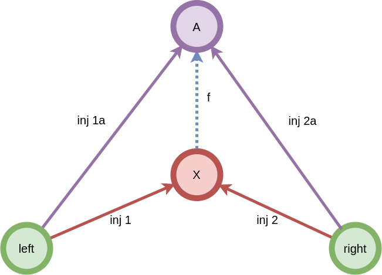

****
[Contents](contents.html)
[Previous](Types.operations.html)
[Next](Types.functions.html)

<!-- START doctoc generated TOC please keep comment here to allow auto update -->
<!-- DON'T EDIT THIS SECTION, INSTEAD RE-RUN doctoc TO UPDATE -->
****

- [Product types](#product-types)
  - [Construction](#construction)
  - [Dependent Pair Types or Σ-types](#dependent-pair-types-or-%CF%83-types)
  - [Utils](#utils)
    - [Product constructor](#product-constructor)
    - [Application of a product](#application-of-a-product)
    - [Map](#map)
    - [Swap](#swap)
- [Co-product types](#co-product-types)
  - [Maybe](#maybe)
  - [API](#api)
    - [Eliminator](#eliminator)
    - [Map](#map-1)
    - [Zip](#zip)

<!-- END doctoc generated TOC please keep comment here to allow auto update -->


```agda
module Types.product where

open import Lang.dataStructures using (
  Bool; true; false;
  ⊥; ⊤; singleton; ℕ; List;
  one; two; three; four; five; six; seven; eight; nine; ten; zero; succ;
  _::_; [])

open import Agda.Primitive using (Level; _⊔_; lsuc; lzero)
```

# Product types

A cartesian product of two types `A` and `B` can be defined as a pair of objects `(a, b)`, where `a` ∈ `A`, and `b` ∈ `B`.

```agda
data _××_ (A B : Set) : Set where
  _,,_  : A → B → A ×× B

infixr 4 _××_
```

Cartesian products can be constructed as:

```agda
oneTwo = one ,, two

oneTwoThree = one ,, (two ,, three)
```

## Construction

While the above definition of cartesian products is intuitive, it's algebraic definition captures the most abstract aspect of a product:

A cartesian product, in set theoretic language, for two sets `A` and `B` is defined as:

```math
A × B = { (a , b) | a ∈ A ~and~ b ∈ B }
```

In  type theory, we look at another way of defining product types, just by looking at them as objects in themselves:
For an object `X`, we call `X` a product type if:

1. There exists two functions, lets call them `proj₁` and `proj₂` such that they can be used to "extract" the contents of the product `X`:

```haskell
proj₁ : {L R : Set} → (L × R) → L
(l × r) = l

proj₂ : {L R : Set} → (L × R) → R
(l × r) = r
```

2. If there is any another object `A`, such that the functions `proj₁ₐ` and `proj₂ₐ` satisfied the above condition for `A`, then there exists a function, `fₐ₀` such that:

```haskell
fₐ₀ : A → X
```

Note: The above is pseudo-code, the proof is below.

The second condition is the condition for the unique-ness of the product, i.e. for all objects having projections to `left` and `right`, there is one through which all projections go through. This object through which we can route all other similar objects is called the "product". We call this one object the "Product" This is better visualized in this diagram:


## Dependent Pair Types or Σ-types

A Dependent type is a type whose definition depends on a value. A dependent pair type is a product type whose second type depends on the first. They are of the form `(x : A, B(x))`. The notation in type theory looks like this for binary dependent pairs:

$$
\sum_{x : A} B(x)
$$

with ternary dependent pair types being represented as:

$$
\sum_{x : A} \sum_{y : B(x)} C(y)
$$

and so on.

The `record` type is a special syntax for representing dependent or Σ (sigma) types. They provide some syntactic sugars like constructors:

```agda
record Σ {a b} (A : Set a) (B : A → Set b) : Set (a ⊔ b) where
  constructor _,_
  field
    fst : A
    snd : B fst

open Σ public

infixr 4 _,_
```

For constructing and studying algebraic structures, a pattern generally followed is:
1. Choose a number of sets of objects.
2. Choose a number of binary operations.
3. Select a bunch properties of the binary operations that they have to adhere to.
4. Combine objects, operations and their properties to form higher mathematical objects.

A combination of a bunch of objects, operations and their properties can be represented as a product type, and is where `record`s are extensively used. Example: if, say `Prop₁` and `Prop₂` are two properties, an object that satisfies both is a record with both properties as fields:

```
data prop1 : Set where
data prop2 : Set where

record Satisfies (x : prop1)(y : prop2) : Set where
  field
    p1 : prop1
    p2 : prop2
```
We extensively use `record`s where we use this pattern.

## Utils

### Product constructor

```agda
_×_ : ∀ {a b} (A : Set a) (B : Set b) → Set (a ⊔ b)
A × B = Σ A (λ x → B)
```

### Application of a product

Apply a pair of functions to a pair of objects.

```agda
<_,_> : ∀ {a b c} {A : Set a} {B : A → Set b} {C : ∀ {x} → B x → Set c}
        (f : (x : A) → B x)
        → ((x : A) → C (f x))
        → ((x : A) → Σ (B x) C)
< f , g > x = (f x , g x)
```

### Map

Mapping a pair of functions `f` and `g` over a product:

```agda
map : ∀ {a b p q} {A : Set a} {B : Set b} {P : A → Set p} {Q : B → Set q}
        → (f : A → B)
        → (∀ {x} → P x → Q (f x))
        → Σ A P
        → Σ B Q
map f g (x , y) = (f x , g y)
```

### Swap

```agda
swap : ∀ {a b} {A : Set a} {B : Set b} → A × B → B × A
swap (x , y) = (y , x)
```

# Co-product types

A "disjoint union" `𝕌` of `X` and `Y` has the property that every element of `𝕌` either maps to an element of `X` or `Y` but not both. Co-products, also called as "sum" types can be thought of as a disjoint union of two objects.

Mathematically, an object `X ⋃ Y` is a co-product of objects `X` and `Y` if,

1. There exists two functions `inj₁` and `inj₂` such that:
```haskell
inj₁ : {A B : Set} → A → (A ∪ B)
a = (a ∪ b)

inj₂ : {A B : Set} → B → (A ∪ B)
b = (a ∪ b)
```

2. If there is any another object `A`, such that the functions `inj₁ₐ` and `inj₂ₐ` satisfied the above condition, then there exists a function, `fₐ₀` such that:

```haskell
fₐ₀ : X → A
```

```agda
data _∪_ {a b} (A : Set a) (B : Set b) : Set (a ⊔ b) where
  inj₁ : (x : A) → A ∪ B
  inj₂ : (y : B) → A ∪ B
```

Co-product types are similar to product types, except with reversed arrows (they are "dual" to products):



## Maybe

Just like the cartesian product is the representative type of a product, the `Maybe` type fills that role for the co-product. This happens to be a very popular datatype in functional programming languages like haskell `Maybe`, scala `Option` etc and is part of a widely used pattern for error handling. The `Maybe` type is a disjoint union of something (a type) or nothing (or an error type). These types can be used to encapsulate behavior of functions that either return a value or an error.

```agda
data Maybe {a} (A : Set a) : Set a where
  just    : (x : A) → Maybe A
  nothing : Maybe A
```

## API

### Eliminator

```agda
maybe : ∀ {a b} {A : Set a} {B : Maybe A → Set b}
        → ((x : A) → B (just x))
        → B nothing
        → (x : Maybe A)
        → B x
maybe j n (just x) = j x
maybe j n nothing  = n
```

### Map

A `Maybe` is also a structure which can be map-ed over:

```agda
smap : ∀ {a b} {A : Set a} {B : Set b} → (A → B) → Maybe A → Maybe B
smap f (just x) = just (f x)
smap f nothing  = nothing
```

### Zip

```agda
zip : ∀ {a b c} {A : Set a} {B : Set b} {C : Set c}
        → Maybe A
        → Maybe B
        → Maybe (A × B)
zip (just a) (just b) = just (a , b)
zip _ _ = nothing
```

****
[Dependent Function Types / Π-types](./Types.functions.html)
