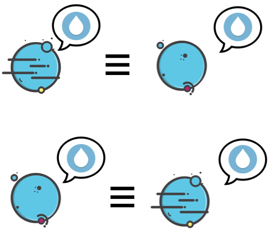

****
[Contents](contents.html)
[Previous](Types.universe.html)
[Next](Types.equality.html)

<!-- START doctoc generated TOC please keep comment here to allow auto update -->
<!-- DON'T EDIT THIS SECTION, INSTEAD RE-RUN doctoc TO UPDATE -->
****

- [Relations](#relations)
  - [Properties of relations](#properties-of-relations)
    - [Reflexive](#reflexive)
    - [Symmetric](#symmetric)
    - [Transitive](#transitive)
    - [Congruent](#congruent)
    - [Substitutive](#substitutive)
- [Equivalence relation](#equivalence-relation)

<!-- END doctoc generated TOC please keep comment here to allow auto update -->


# Relations

```agda
module Types.relations where
```

Relations can be defined as properties that assign truth values to finite tuples of elements. A binary relation would output a truth value given two objects, similarly a unary relation would apply on a single object to output a truth value. This can be generalized to k-ary relations. In type theory, however, since relations are also types and "truth values" of a proposition is replaced by existence or belonging to the universe of all types, one can think of relations as functions that take n-tuples as input and return some  object of type `Set1` - the set of all `Set`s. A binary relation `∙` between two objects `a` and `b` is a function type:

```agda
Rel : Set → Set1
Rel A = A → A → Set
```

A relation with universe polymorphism could also be defined as:

```agda
open import Agda.Primitive using (Level; _⊔_; lsuc)

-- heterogenous relation
REL : ∀ {a b} → Set a → Set b → (ℓ : Level) → Set (a ⊔ b ⊔ lsuc ℓ)
REL A B ℓ = A → B → Set ℓ

-- homogenous relation
R : ∀ {a} → Set a → (ℓ : Level) → Set (a ⊔ lsuc ℓ)
R A ℓ = REL A A ℓ
```

The first definition being easier for our purposes here, we proceed with that.

## Properties of relations

Relations can conform to certain properties, which later come in handy for classifying relations and building a lot of mathematical structure.

### Reflexive

A reflexive relation is one where $$ x ∙ y = y ∙ x $$:


```agda
reflexive : {A : Set}
  → Rel A
  → Set
reflexive {A} _★_ = (x : A) → x ★ x
```

### Symmetric

A symmetric relation is one where $$ x ∙ y ⟹ y ∙ x $$:



```agda
symmetric : {A : Set} → Rel A → Set
symmetric {A} _★_  = (x y : A)
  → x ★ y
  → y ★ x
```

### Transitive

A transitive relation is one where $$ x ∙ y, y ∙ z ~then~ z ∙ x $$:


```agda
transitive : {A : Set} → Rel A → Set
transitive {A} _★_ = (x y z : A)
  → x ★ y
  → y ★ z
  → x ★ z
```

### Congruent

A congruent relation is one where a function $$ x ∙ y ⟹ f(x) ∙ f(y) $$ or the function `f` preserves the relation :

```agda
congruent : {A : Set} → Rel A → Set
congruent {A} _★_ = (f : A → A)(x y : A)
  → x ★ y
  → f x ★ f y
```

### Substitutive

A substitutive relation is one where $$ x ∙ y ~and~ (predicate~ y) = ⊤ ⟹ (predicate~ x) = ⊤ $$ :

```agda
substitutive : {A : Set} → Rel A → Set1
substitutive {A} _★_ = (P : A → Set)(x y : A)
  → x ★ y
  → P x
  → P y
```

# Equivalence relation

An equivalence relation is a relation which is:

- reflexive: a = a
- symmetric: if a = b then b = a
- transitive: if a = b and b = c then a = c

All forms of what we know as "equality" are equivalence relations. They help in identifying similar objects and can be "weak" or "strong" depending upon how much similarity they capture of the objects they compare. For e.g. all "tables" fall under one equivalence class wherein when we refer to a generic "table" we mean as in all tables as equal. Whereas, if we were comparing tables amongst themselves, we'd use other finer criteria in our equivalence relations, classifying some tables as coffee tables and so on.

```agda
record Equivalence (A : Set) : Set1 where
  field
    _==_  : Rel A
    refl  : reflexive _==_
    sym   : symmetric _==_
    trans : transitive _==_
```

****
[Equality](./Types.equality.html)
