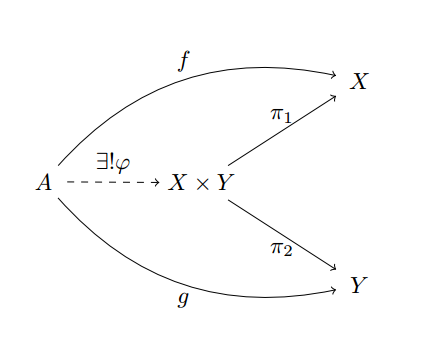

<!-- START doctoc generated TOC please keep comment here to allow auto update -->
<!-- DON'T EDIT THIS SECTION, INSTEAD RE-RUN doctoc TO UPDATE -->
****

- [Product types or tuples](#product-types-or-tuples)
- [But What is a product?](#but-what-is-a-product)
  - [Uniqueness proof](#uniqueness-proof)
- [Co-product types](#co-product-types)

<!-- END doctoc generated TOC please keep comment here to allow auto update -->


```agda
module Types.typeBasics where

open import Lang.dataStructures using (
  Bool; true; false;
  ⊥; ⊤; ℕ; List;
  one; two; three; four; five; six; seven; eight; nine; ten; zero; succ;
  _::_; [])

open import Level
```

# Product types or tuples

A cartesian product of two types `A` and `B` can be defined as a pair of objects `(a, b)`, where `a` ∈ `A`, and `b` ∈ `B`.

```agda

data _×_ (A B : Set) : Set where
  _,_  : A → B → A × B

infixr 4 _×_
```

and cartesian products constructed as

```agda
oneTwo = one , two

oneTwoThree = one , (two , three)
```
Some exmaples of product types in programming languages are for e.g. tuples in scala:

```scala
val tuple:Tuple3[String, String, String] = ("a", "pointless", "tuple")
```
though a large number of datatypes are sub-types of products, e.g.

```scala
None, Option, Some,
ScalaReflectionException,
StringContext,
UninitializedFieldError,
Found,
InsertionPoint,
::, List, Nil,
ScanLeaf, ScanNode,
Deadline,
Either, LeftProjection, RightProjection, Failure, Left, Right, Success,
Try, Call, Cont, Done,
CompositeThrowable,
End, Include, Index,
NoLo, Remove, Reset, Start, Update,
DocBreak, DocCons, DocGroup, DocNest, DocNil, DocText
```

# But What is a product?

While being intuitively familiar with what a cartesian product is, it's algebraic definition captures the most abstract aspect of a product:

A cartesian product, in set theory, for two sets `A` and `B` is defined as:

$$ A x B = \{ (a , b) | a ∈ A ~and~ b ∈ B \} $$

We look at another way of defining product types, just by looking at them as objects in themselves:
For an object `X`, we call `X` a product type if:

1. There exists two functions, lets call them `proj₁` and `proj₂` such that they can be used to "extract" the contents of the product `X`:

```haskell
proj₁ : {A B : Set} → (A × B) → A
(a × b) = a

proj₂ : {A B : Set} → (A × B) → B
(a × b) = b
```

2. If there is any another object `A`, such that the functions `proj₁ₐ` and `proj₂ₐ` satisfied the above condition, then there exists a function, `fₐ₀` such that:

```haskell
fₐ₀ : A → X
```

Note: The above is pseudo-code, the proof is below.

The second condition is the unique-ness condition, .i.e. for all objects having projections to `A` and `B`, there is one through which all projections go through. We call this one object the "Product" This is better visualized in this diagram:



Agda's `Record` types provides encapsulate this definition:

```agda
record Σ {a b} (A : Set a) (B : A → Set b) : Set (a ⊔ b) where
  constructor _,_
  field
    fst : A
    snd : B fst

open Σ public

infixr 4 _,_
```

The `Σ` type is also called a "Dependent" or "Σ" type, as in the second parameter to `record` depends upon the type `A`, the first parameter.

## Uniqueness proof

To prove uniqueness of a product, we first have to define what existence is:

```agda
∃ : ∀ {a b} {A : Set a} → (A → Set b) → Set (a ⊔ b)
∃ = Σ _
```

A `syntax` declaration binds a pattern to a specified syntax. We define a syntax for Σ:

```agda
infix 2 Σ-syntax

Σ-syntax : ∀ {a b} (A : Set a) → (A → Set b) → Set (a ⊔ b)
Σ-syntax = Σ

syntax Σ-syntax A (λ x → B) = Σ[ x ∈ A ] B
```

Then we proceed to define composition in the form of Σ-syntax:

```agda
_××_ : ∀ {a b} (A : Set a) (B : Set b) → Set (a ⊔ b)
A ×× B = Σ[ x ∈ A ] B
```

We then proceed with the proof:

```agda
∃! : ∀ {a b ℓ} {A : Set a} → (A → A → Set ℓ) → (A → Set b) → Set (a ⊔ b ⊔ ℓ)
∃! _≈_ B = ∃ λ x
  → B x ×× (∀ {y} → B y → x ≈ y)
```

# Co-product types

Co-products, also called as "sum" types can be thought of as a disjoint uinon of two objects.

Mathematically, an object `X∪Y` is a co-product of objects `X` and `Y` if,

1. There exists two functions `inj_₁` and `inj₂` such that:
```haskell
proj₁ : {A B : Set} → A → (A ∪ B)
a = (a ∪ b)

proj₂ : {A B : Set} → B → (A ∪ B)
b = (a ∪ b)
```

2. If there is any another object `A`, such that the functions `inj₁ₐ` and `inj₂ₐ` satisfied the above condition, then there exists a function, `fₐ₀` such that:

```haskell
fₐ₀ : X → A
```

```agda
data _∪_ {a b} (A : Set a) (B : Set b) : Set (a ⊔ b) where
  inj₁ : (x : A) → A ∪ B
  inj₂ : (y : B) → A ∪ B
```

****
[Back to Contents](./contents.html)
