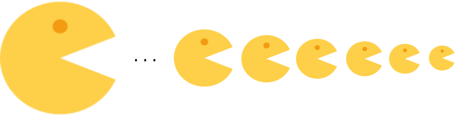

****
[Contents](contents.html)
[Previous](Types.introduction.html)
[Next](Types.relations.html)

<!-- START doctoc generated TOC please keep comment here to allow auto update -->
<!-- DON'T EDIT THIS SECTION, INSTEAD RE-RUN doctoc TO UPDATE -->
****

- [Universes and families](#universes-and-families)
- [Universes in Agda](#universes-in-agda)
- [Universe Polymorphism](#universe-polymorphism)
- [Machinery on Types](#machinery-on-types)
  - [Type of](#type-of)
  - [Equality of types](#equality-of-types)
  - [Identity type](#identity-type)

<!-- END doctoc generated TOC please keep comment here to allow auto update -->

```agda


module Types.universe where

open import Lang.dataStructures using (
  Bool; true; false;
  ⊥; ⊤; ℕ; List;
  zero; one)

open import Agda.Primitive renaming (
  Level to AgdaLevel;
  lzero to alzero;
  lsuc to alsuc;
  _⊔_ to _⊔⊔_)
```

# Universes and families

A `universe` can be thought of as a container for all of mathematics. There is no mathematics that is possible outside of its universe. Thus, one can think of universes of types to contain all types, a universe of sets contains all sets and so on. One could also think of universes as a collection of entities that one needs to work with − for e.g. for proving a theorem on sets, one could work in a universe of sets.

Formally, the structure of the universe used in type theory are [Russel-style and Tarski-style universes](http://www.cs.rhul.ac.uk/home/zhaohui/universes.pdf) though we use the former as it is easier and sufficient for our purposes. There are other kinds of universes in mathematics, for example the [Grothendieck universe](https://ncatlab.org/nlab/show/Grothendieck+universe), [Von Neumann universe](https://en.wikipedia.org/wiki/Von_Neumann_universe).

The type of all types is called `Set` in agda. Now, in constructing this type of all types naively we encounter a bunch of paradoxes, namely [Russel's Paradox](https://ncatlab.org/nlab/show/Russell%27s+paradox), [Cantor's Paradox](https://ncatlab.org/nlab/show/Cantor%27s+paradox), [Girard's Paradox](https://ncatlab.org/nlab/show/Burali-Forti%27s+paradox) etc. These can be avoided by constructing the type of all types as "universes" in a hierarchically cumulative way. When we consider our universe to be the set of all types, we say that our universe is constructed hierarchically, with an index `i` such that universe `Uᵢ` ∈ Uᵢ₊₁ and so on.

$$
U_{0} \in U_{1} \in U_{2} \in ... \in U_{i} \in U_{i+1}  \in ... \in U_{\infty}
$$

This avoids the problem of Russel's paradox, which implies that the set of all sets itself is not a set. Namely, if there were such a set `U`, then one could form the subset `A ⊆ U` of all sets that do not contain themselves. Then we would have `A ∈ A` if and only if `A ∉ A`, a contradiction.

Let us define the above index `i` of universe `Uᵢ`, called `Level` in Agda's standard library:

```agda
infixl 6 _⊔_

postulate
  Level : Set
```

We define it as a postulate so we don't have to provide an implementation yet. We continue to define some operations on it, i.e.:

- `lzero`, the trivial level 0
- `lsuc` : successive iterator
- `_⊔_` : least upper bound, an operator that composes

```agda
postulate
  lzero : Level
  lsuc  : (ℓ : Level) → Level
  _⊔_   : (ℓ₁ ℓ₂ : Level) → Level
```

And finally, we define universe as:

```haskell
record Universe u e : Set (lsuc (u ⊔ e)) where
  field
    -- Codes.
    U : Set u

    -- Decoding function.
    El : U → Set e
```



A "family" of types varying over a given type are called, well "families of types". An example of this would be the finite set, [Fin](./dataStructures.html#finite-sequences) where every finite set has `n` elements where `n ∈ ℕ` and hence `Fin`, the creator of finite sets, is dependent on ℕ.

# Universes in Agda

- Every Agda type is of type `Set`, i.e. `Set : Set₁`.
- Each universe level is an element of the next universe level: `Setᵢ ∈ Setᵢ₊₁`.
- There exist infinite universe levels in Agda: `Set₁ : Set₂ : Set₃ : ...`.

In some implementations, universes are represented using a different keyword `Type` instead of `Set` in order to avoid confusion:

```agda
Type : (i : AgdaLevel) → Set (alsuc i)
Type i = Set i

Type₀ = Type alzero
Type0 = Type alzero

Type₁ = Type (alsuc alzero)
Type1 = Type (alsuc alzero)
```

# Universe Polymorphism

Now, given that we have infinite hierarchial universes, we would have to define the same functions, data types, proofs and other machinery for each universe level, which would be pretty tedious to say the least. However, we observe how our universes are defined and note that the level-based indexing system, that connects each successive universe, provides us with the mechanics to define math for all universe levels `ℓ`. Programmers would find this is nothing but the widely used pattern called [Polymorphism](https://en.wikipedia.org/wiki/Polymorphism_(computer_science)):

```agda
id : {ℓ : AgdaLevel} {A : Set ℓ} (x : A) → A
id x = x
```
Here `id` represents a family of identity functions given a type `A` and its level `ℓ` and works for all universe levels.

```agda
infixr 5 _::_
data List₁ {ℓ : AgdaLevel} (A : Set ℓ) : Set (alsuc ℓ) where
  [] : List₁ A
  _::_ : A → List₁ A → List₁ A

someList : List₁ ℕ
someList = (one :: zero :: [])

sameList : List₁ ℕ
sameList = id someList
```

# Machinery on Types

We now define some utility machinery for operating on types.

## Type of

We obviously need a means to check types:

```agda
typeof : ∀ {i} (A : Type i) (u : A) → A
typeof A u = u

infix 40 typeof
syntax typeof A u =  u :> A
```

## Equality of types

```agda
infix 30 _==_
data _==_ {i} {A : Type i} (a : A) : A → Type i where
  idp : a == a
```

## Identity type

The equality of types is itself a type - the identity type:

```agda
Path = _==_
```

The reason for calling this a `Path` has a huge backstory, which we will explore in [Homotopy Type Theory](./HoTT.introduction.html).

****
[Relations](./Types.relations.html)

