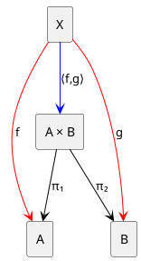
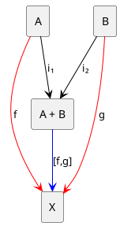

****
[Contents](contents.html)
[Previous](Types.operations.html)
[Next](Types.functions.html)

# Products & Co-products

****

- [Products \& Co-products](#products--co-products)
  - [Introduction](#introduction)
  - [Products](#products)
    - [Definition](#definition)
    - [Products in Lean](#products-in-lean)
  - [Co-products](#co-products)
    - [Definition](#definition-1)
    - [Co-products in Lean](#co-products-in-lean)
  - [Dependent Product Types](#dependent-product-types)

## Introduction

Products and co-products are the most basic forms of type constructors in type theory. They are used to combine types in a way that preserves the information of the original types. Let us first start with a very informal definition of products and co-products.

Suppose we have a bunch of types `A`, `B`, `C`, `D`, etc. A product of these types is a type that contains all possible combinations of elements from `A`, `B`, `C`, `D`, etc. In the context of programming, this is similar to a tuple or a record:

```scala
case class Tuple2[A, B](a: A, b: B)
```

```java
type Tuple2<A, B> = Pair<A, B>
```

In both the above examples, we define a new type or class (an enclosure) that contains two elements of types `A` and `B`. This is a product type and is a very obvious way to combine types widely used in programming.

A co-product, on the other hand, is a type that can be either of the types `A`, `B`, `C`, or `D`, etc. In programming, this is similar to a "sum" type or a union in Scala:

```scala
sealed trait Either[A, B]
case class Left[A, B](a: A) extends Either[A, B]
case class Right[A, B](b: B) extends Either[A, B]
```

or for example Either type in languages like Java:

```java
interface Either<A, B> {
  A getLeft();
  B getRight();
}
```

In the above examples of coproducts, we define a new type or class (an enclosure) that can be either of the two types `A` or `B`. This is a co-product type and is a very useful way to often handle errors or exceptions in programming, another very popular example being the `Option` type which is specialized to either contain a result or an error.

## Products

In Type Theory, for two given types `A` and `B`, the product of `A` and `B` is a type `A × B` that represents all possible pairs of elements `(a, b)` where `a : A` and `b : B`.

```math
A × B = \{ (a, b) \mid a : A, b : B \}
```

A product can be mapped to its components using two functions `fst` and `snd` that extract the first and second elements of the pair respectively.

```math
fst : A × B → A
```

```math
snd : A × B → B
```

### Definition

The categorical definition of a product is that it is a type `Prod` that comes with two projection functions `π₁` and `π₂` that satisfy the following universal property:

Let `A \x B` be the product type of types `A` and `B`. Then for any other type `X` which also has functions `f : X → A` and `g : X → B`, there exists a unique function `⟨f, g⟩ : X → Prod` such that `π₁ ∘ ⟨f, g⟩ = f` and `π₂ ∘ ⟨f, g⟩ = g`.

The following diagram illustrates the universal property of a product type:



The way this is interpreted is that, consider `A × B` as a product type of `A` and `B`. Thus `A × B` is a type that contains pairs of elements `(a, b)` where `a : A` and `b : B`. However there can be more such types that also contains some form of pairs of `(a:A, b:B)` too! Hence we need to distinguish between the true product type and the other types that contain pairs of `(a, b)`. To do this, we take advantage of the fact that the product type of `A` and `B` is unique.

Say we have a type `X` that contains pairs of `(a, b)` too. Then we can have two functions `f : X → A` and `g : X → B` that map the pairs of `X` to `A` and `B` respectively. Uniquness of `A × B` is guaranteed by the fact that for any other `X`, there exists a unique function `⟨f, g⟩ : X → A × B` that maps `X` to `A × B` such that `π₁ ∘ ⟨f, g⟩ = f` and `π₂ ∘ ⟨f, g⟩ = g`. This is the universal property of a product type.

### Products in Lean

In Lean, we can define a product type as:

```lean
inductive Prod (A B : Type) : Type
| mk : A → B → Prod
```

Here, `Prod` is a type constructor that takes two types `A` and `B` and returns a new type `Prod A B`. The type `Prod A B` is then defined as a type that contains all possible pairs of elements `(a, b)` where `a : A` and `b : B`.

We can also define projection functions `fst` and `snd` that extract the first and second elements from a product type:

```lean
def fst {A B : Type} : Prod A B → A
| (Prod.mk a b) := a

def snd {A B : Type} : Prod A B → B
| (Prod.mk a b) := b
```

Now, we can define a simple example of a product type:

```lean
def pair := Prod.mk 1 "hello"
```

Here, `pair` is a product of `Nat` and `String`. We can then extract the first and second elements from `pair` using the projection functions:

```lean
#eval fst pair -- 1
#eval snd pair -- "hello"
```

The above code will return `1` and `"hello"` respectively.

## Co-products

In Type Theory, for two given types `A` and `B`, the co-product (or sum) of `A` and `B` is a type `A + B` that represents all possible values that can be either from `A` or from `B`, along with the information about which type the value came from.

```math
A + B = \{ inl(a) \mid a : A \} ∪ \{ inr(b) \mid b : B \}
```

A co-product comes with two injection functions `inl` and `inr` that inject values from either type into the co-product:

```math
inl : A → A + B
```

```math
inr : B → A + B
```

### Definition

The categorical definition of a co-product is that it is a type `Sum` that comes with two injection functions `i₁` and `i₂` that satisfy the following universal property:

For any type `X` and functions `f : A → X` and `g : B → X`, there exists a unique function `[f, g] : Sum → X` such that `[f, g] ∘ i₁ = f` and `[f, g] ∘ i₂ = g`.

The following diagram illustrates the universal property of a co-product type:



This can be interpreted as follows: Consider `A + B` as a co-product type of `A` and `B`. Thus `A + B` is a type that contains either values from `A` or values from `B`. However, there might be other types that can also represent this choice! Hence we need to distinguish between the true co-product type and other types that represent this choice. If we have a type `X` that can represent this choice, then we can have two functions `f : A → X` and `g : B → X` that map values from `A` and `B` to `X`. The uniqueness of `A + B` as the true co-product is guaranteed by the existence of a unique function `[f, g] : A + B → X` that satisfies the universal property.

### Co-products in Lean

In Lean, we can define a co-product type as:

```lean
inductive Sum (A B : Type) : Type
| inl : A → Sum
| inr : B → Sum
```

Here, `Sum` is a type constructor that takes two types `A` and `B` and returns a new type `Sum A B`. The type `Sum A B` is then defined as a type that can contain either a value of type `A` or a value of type `B`.

We can also define a case analysis function that handles both cases of a sum type:

```lean
def case_analysis {A B X : Type} (f : A → X) (g : B → X) : Sum A B → X
| (Sum.inl a) := f a
| (Sum.inr b) := g b
```

Now, we can define simple examples of co-product types:

```lean
def left := Sum.inl 42
def right := Sum.inr "world"

def toString {A B} [ToString A] [ToString B] : Sum A B → String :=
case_analysis (λ a, s!"left({toString a})") (λ b, s!"right({toString b})")

#eval toString left  -- "left(42)"
#eval toString right -- "right(world)"
```

## Dependent Product Types

Dependent product or pair types generalizes the concept of product types by allowing the type of one component to depend on the value of another component. Unlike simple product types where both types are fixed and independent, dependent product types create a relationship where the second type is a function of the value of the first type.

Mathematically, dependent product types are denoted as Σ-types (sigma types) and are defined as:

```math
Σ(x : A) B(x) = \{ (a, b) \mid a : A, b : B(a) \}
```

Here, `A` is a type and `B` is a type family indexed by `A`. The dependent pair `(a, b)` consists of a value `a : A` and a value `b : B(a)` where `B(a)` is the type of the second component that depends on the value of `a`.

A relatable example for programmers is the type of sized arrays or vectors, where the length of the array is part of the type itself. In typescript for example, we can define a tuple that can only have 3 elements as:

```typescript
type Vec3 = [number, number, number];
```

or using templates in C++:

```cpp
template <typename T, int N>
struct array {
    T data[N];
};
```

Other functional programming languages like Haskell sized vectors can be defined as:

```haskell
data Vector n a where
    Nil  :: Vector 0 a
    Cons :: a -> Vector n a -> Vector (n + 1) a
```

Though most mainstream languages do not support dependent types, languages like Idris, Agda, and Lean have built-in support for dependent types.

In Lean, we can define dependent product types as:

```lean
inductive Sigma {A : Type} (B : A → Type) : Type
| mk : Π (a : A), B a → Sigma
```

Here, `Sigma` is a type constructor that takes a type `A` and a type family `B : A → Type` and returns a new type `Sigma B`. The type `Sigma B` is then defined as a type that contains all possible dependent pairs `(a, b)` where `a : A` and `b : B a`.

****
[Dependent Function Types / Π-types](./Types.functions.html)
