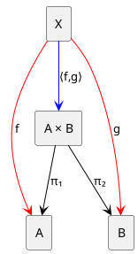

****
[Contents](contents.html)
[Previous](Types.operations.html)
[Next](Types.functions.html)

# Products & Co-products

****

- [Products \& Co-products](#products--co-products)
    - [Introduction](#introduction)
    - [Products](#products)
        - [Introduction](#introduction-1)
        - [Definition](#definition)
        - [Products in Lean](#products-in-lean)

## Introduction

Products and co-products are the most basic forms of type constructors in type theory. They are used to combine types in a way that preserves the information of the original types. Let us first start with a very informal definition of products and co-products.

Suppose we have a bunch of types `A`, `B`, `C`, `D`, etc. A product of these types is a type that contains all possible combinations of elements from `A`, `B`, `C`, `D`, etc. In the context of programming, this is similar to a tuple or a record:

```scala
case class Tuple2[A, B](a: A, b: B)
```

```java
type Tuple2<A, B> = Pair<A, B>
```

In both the above examples, we define a new type or class (an enclosure) that contains two elements of types `A` and `B`. This is a product type and is a very obvious way to combine types widely used in programming.

A co-product, on the other hand, is a type that can be either of the types `A`, `B`, `C`, `D`, etc. In programming, this is similar to a sum type or a union in Scala:

```scala
sealed trait Either[A, B]
case class Left[A, B](a: A) extends Either[A, B]
case class Right[A, B](b: B) extends Either[A, B]
```

or for example Either type in Java:

```java
interface Either<A, B> {
  A getLeft();
  B getRight();
}
```

In both the above examples, we define a new type or class (an enclosure) that can be either of the two types `A` or `B`. This is a co-product type and is a very useful way to often handle errors or exceptions in programming, another very popular example being the `Option` type.

## Products

### Introduction

In Type Theory, for two given types `A` and `B`, the product of `A` and `B` is a type `A × B` that represents all possible pairs of elements `(a, b)` where `a : A` and `b : B`.

```math
A × B = \{ (a, b) \mid a : A, b : B \}
```

A product can be mapped to its components using two functions `fst` and `snd` that extract the first and second elements of the pair respectively.

```math
fst : A × B → A
```

```math
snd : A × B → B
```

### Definition

The categorical definition of a product is that it is a type `Prod` that comes with two projection functions `π₁` and `π₂` that satisfy the following universal property:

For any type `X` and functions `f : X → A` and `g : X → B`, there exists a unique function `⟨f, g⟩ : X → Prod` such that `π₁ ∘ ⟨f, g⟩ = f` and `π₂ ∘ ⟨f, g⟩ = g`.

The way this is interpreted is that, consider `A x B` as a product type of `A` and `B`. Thus `A x B` is a type that contains pairs of elements `(a, b)` where `a : A` and `b : B`. However there can be more such types that also contains some form of pairs of `(a:A, b:B)` too! Hence we need to distinguish between the true product type and the other types that contain pairs of `(a, b)`. Say we have a type `X` that contains pairs of `(a, b)` too. Then we can have two functions `f : X → A` and `g : X → B` that map the pairs of `X` to `A` and `B` respectively. Now, we exploit the fact that `A x B` being the true product type, it should be unique! Uniquness is guaranteed by the fact that there exists a unique function `⟨f, g⟩ : X → A x B` that maps the pairs of `X` to `A x B` such that `π₁ ∘ ⟨f, g⟩ = f` and `π₂ ∘ ⟨f, g⟩ = g`. This is the universal property of a product type.

The following diagram illustrates the universal property of a product type:



### Products in Lean

In Lean, we can define a product type as:

```lean
inductive Prod (A B : Type) : Type
| mk : A → B → Prod
```

Here, `Prod` is a type constructor that takes two types `A` and `B` and returns a new type `Prod A B`. The type `Prod A B` is then defined as a type that contains all possible pairs of elements `(a, b)` where `a : A` and `b : B`.

We can also define projection functions `fst` and `snd` that extract the first and second elements from a product type:

```lean
def fst {A B : Type} : Prod A B → A
| (Prod.mk a b) := a

def snd {A B : Type} : Prod A B → B
| (Prod.mk a b) := b
```

Now, we can define a simple example of a product type:

```lean
def pair := Prod.mk 1 "hello"
```

Here, `pair` is a product of `ℕ` and `String`. We can then extract the first and second elements from `pair` using the projection functions:

```lean
#eval fst pair -- 1
#eval snd pair -- "hello"
```

The above code will return `1` and `"hello"` respectively.


****
[Dependent Function Types / Π-types](./Types.functions.html)
